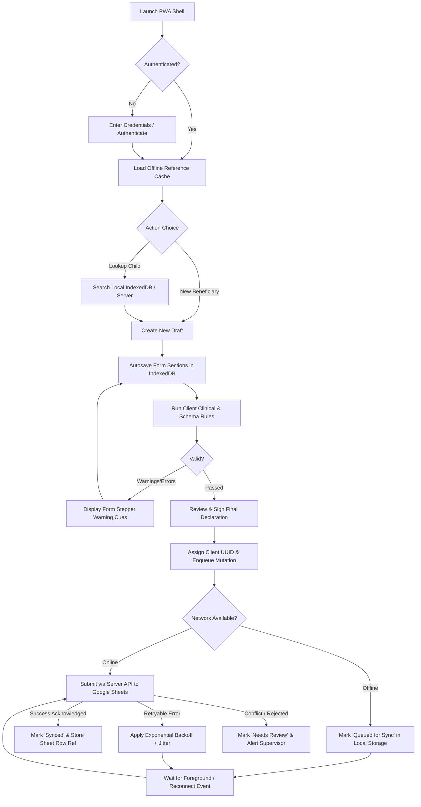

# Product Requirements Document (PRD)
## Childcare Support — Phase 3: Children Nutrition and Education Support PWA

**Document Version:** 1.0.0-PROD-DISCOVERY  
**Classification:** Official / Restricted — Sensitive Health Information  
**Target Repository:** `Faribro/Childcare-Support---Phase-3-`  
**Target Operational Database:** Google Sheets (`1tg1ROn5TbOumuCvpSlxG7OxhayYodnmoiA7qMPkbXfA`)  
**Target Apps Script ID:** `1yXEgElXFb0Fb_CzTlQ8TDvRUuEYmq5dady7ialsqMnkAU1XX5SPJW8P3`  
**Hosting Environment:** Render Web Service (Node.js App / Server API)  
**Author / Lead:** Staff Digital Systems Lead (Antigravity)  
**Status:** Under Programme Discovery & Data Contract Verification  

---

## 1. Executive Summary & Problem Statement

### 1.1 Executive Summary
Childcare Support — Phase 3 delivers an enterprise-grade, offline-first Progressive Web Application (PWA) engineered specifically for field caseworkers, Community Support Centres (CSCs), and clinical supervisors supporting children living with or affected by HIV across India. 

Operating under the institutional governance of the India HIV/AIDS Alliance and partner community networks, the system streamlines beneficiary intake, clinical nutrition tracking (anthropometry, BMI z-score classifications, haemoglobin thresholds, and viral load suppression), educational support grant disbursements (tuition fees, books, uniforms, and transport), and supporting documentation verification.

The platform bridges erratic, zero-connectivity field conditions in rural and peri-urban Antiretroviral Therapy (ART) Centres with the organisation's central reporting infrastructure via an asynchronous, idempotent Google Sheets and Apps Script data bridge, backed by an ACID-like local IndexedDB operational engine.

### 1.2 Problem Statement
Field caseworkers and CSC coordinators currently encounter four critical operational bottlenecks:
1. **Network Fragility in Clinical Settings**: ART centres and home visits frequently suffer from zero or intermittent mobile connectivity. Historically, web-bound tools failed to load or dropped submissions, forcing staff to revert to manual paper records that introduced months of reporting delay.
2. **Data Loss & Concurrency Collisions**: Synchronous direct writes to Google Sheets via legacy web apps result in frequent HTTP timeouts (Google Apps Script's 6-minute execution limit), lost submissions, duplicate rows during network retries, and corrupted cell formulas.
3. **Clinical Vulnerability & Data Drift**: Paediatric HIV care requires strict time-series monitoring of viral loads, clinical anaemia, and acute malnutrition. Fragmented spreadsheets lack strict runtime validation, permitting data errors such as negative ages, incompatible tuition fees for school dropouts, and unverified bank accounts.
4. **Data Privacy & Sensitive Paediatric Records**: Information regarding minors and their HIV-related care journey is sensitive personal data. Historical monolithic web dashboards exposed unredacted line-lists and script credentials to the browser runtime without auditability or cryptographic session controls.

---

## 2. In-Scope and Explicitly Out-of-Scope Functionality

| Functional Domain | In-Scope (Phase 3 Core Deliverables) | Explicitly Out-of-Scope (Deferred / Prohibited) |
| :--- | :--- | :--- |
| **PWA Application Shell** | Installable, lightweight, standalone PWA on Android (tablets/smartphones) and Chromium desktops. Service Worker caching for complete offline shell readiness. | Native compiled APKs / iOS App Store binaries; packaging inside third-party wrappers like Cordova. |
| **Form Execution** | Schema-driven multi-step assessment wizard: Demographics, Household Finance, Clinical Nutrition & ART, Education Support, Bank Details, and Document Uploads. | Ad-hoc dynamic form builders that allow field enumerators to alter official questionnaire items on the fly. |
| **Local Data & Drafts** | Automatic field-level autosave to client-side IndexedDB (`Dexie.js`), explicit draft persistence, draft resumption, and discard safeguards. | Multi-user shared device concurrent draft merging without explicit user re-authentication. |
| **Validation Engine** | Runtime client-side Zod validation with instantaneous clinical conflict alerts (BMI z-score warning, anaemia thresholds, dropout fee conflicts). | Medical diagnostic recommendations or automated prescription alterations. |
| **Synchronisation Bridge** | Offline mutation queue with exponential backoff + jitter, foreground reconnect trigger, manual force-sync, and client-generated UUID idempotency keys. | Direct raw bi-directional peer-to-peer sync between field phones without central server brokering. |
| **Google Sheets Integration** | Idempotent upsert via Apps Script webhook adapter; dedicated `Submission_Index` tracking; protected schema mapping. | Direct browser-to-Sheets API calls exposing service account OAuth keys or raw Google APIs in client bundles. |
| **Supervisor Read-Models** | Clean, role-governed line-list viewer, record status filters, duplicate candidate flagging, and read-only aggregation statistics. | Unrestricted public data dumps, full line-list bulk Excel export by unauthenticated field accounts. |
| **Identity & Access** | Server-brokered session authentication, role-based view permissions (Enumerator, Supervisor, Admin), HttpOnly signed tokens. | Open public anonymous registration without administrator approval or pre-provisioned roster validation. |

---

## 3. User Personas & Operational Constraints

### Persona 1: Field Enumerator / Caseworker (Pooja)
- **Role & Organisation:** CSC Field Outreach Worker / ART Counsellor (Alliance India Field Partner).
- **Primary Tasks:** Visiting paediatric beneficiaries, conducting quarterly nutritional checks, verifying school receipts, recording caregiver bank details, and submitting grant applications.
- **Operating Environment:** Low-cost Android smartphone (Android 10+, 3GB RAM, 32GB storage, high ambient sunlight).
- **Connectivity:** Low-bandwidth 2G/3G or completely offline in hospital basements and rural wards.
- **Sensitive Data Needs:** Access restricted strictly to assigned children or newly created intake drafts; cannot view national financial summaries or other centres' line-lists.

### Persona 2: Clinical Supervisor / Project Officer (Rajesh)
- **Role & Organisation:** State Programme Officer / Clinical Operations Reviewer.
- **Primary Tasks:** Reviewing submitted child linelists, evaluating critical alerts (severe anaemia $<7$ g/dL, unsuppressed viral load $>1000$ copies/mL), verifying fee receipts, and approving educational grant disbursements.
- **Operating Environment:** Office laptop (Chrome on Windows/Linux) or 10-inch Android tablet.
- **Connectivity:** Reliable broadband or 4G LTE in state headquarters.
- **Sensitive Data Needs:** Full state-level read access, record audit logs, authorization to approve/flag records, ability to reconcile duplicate entries.

### Persona 3: Technical Administrator (Farid / Central IT)
- **Role & Organisation:** System Architect / Antigravity Operations Lead.
- **Primary Tasks:** Monitoring synchronization queue health, maintaining Google Apps Script webhook bridges, managing user roles, rotating integration secrets, and auditing system error logs.
- **Operating Environment:** Multi-monitor desktop workstation, developer CLI, Render console, Google Cloud/Workspace Admin.
- **Sensitive Data Needs:** System metadata, audit logs, service telemetry, configuration keys. No operational need for unmasked child clinical names during debugging.

### Persona 4: Programme Analyst & Monitoring Lead (Manish Sir / Leadership)
- **Role & Organisation:** Programme Director / National Monitoring & Evaluation Lead.
- **Primary Tasks:** Assessing aggregate nutritional trends, state-by-state education grant allocations, supply-chain gaps, and partner CSC performance.
- **Operating Environment:** Desktop browser / tablet viewing aggregated management dashboards.
- **Sensitive Data Needs:** De-identified, aggregated indicator reports, district heatmaps, and financial totals; no direct need for daily field draft inspections.

---

## 4. End-to-End User Journeys



### 4.1 Detailed User Journey Specifications

#### Journey J-01: First Installation & Offline Seeding
- **Context:** Caseworker installs the PWA while connected to CSC Wi-Fi prior to field travel.
- **Trigger:** Navigates to Render application URL and taps "Install Childcare Portal".
- **Path:** Service worker caches core static assets (JS chunks, WOFF2 fonts, SVG icons, app manifest). Application authenticates user and triggers background download of master lookup tables (States, Districts, CSC facilities, standard school classifications).
- **Completion:** System notifies user: *"Ready for offline use. 36 states and local facility directory cached."*

#### Journey J-02: Child Lookup & Intake Registration
- **Trigger:** Caseworker meets beneficiary caregiver at ART centre.
- **Path:** Caseworker enters child name, ART ID, or Aadhaar fragment into search bar. System queries IndexedDB index. If found, prompts to create a new clinical follow-up session; if not found, initializes a blank intake form.

#### Journey J-03: Form Drafting, Section Navigation & Autosave
- **Trigger:** Caseworker fills demographics, anthropometry, and education grant requests.
- **Path:** Every input change fires a debounced (400ms) IndexedDB write to `drafts` table. Section headers update completion badges (e.g. Demographics: Complete, Nutrition: 2 Warnings). User can shut down browser or device without losing entered fields.

#### Journey J-04: Local Clinical Validation & Sanity Verification
- **Trigger:** Caseworker navigates to "Review & Finalize" tab.
- **Path:** Validation engine checks:
  - *Age calculation:* Compares Date of Birth with visit date; flags children $>18$ years.
  - *Nutrition indicators:* Computes BMI ($kg/m^2$); flags severely underweight ($<16.0$) or severe anaemia ($Hb < 7.0\ g/dL$).
  - *Education grant sanity:* Flags non-zero tuition fee if attendance status is marked "Dropout" or "Never Enrolled".
- **Visual Feedback:** Shows explicit amber alert banners with line-jump links to problematic fields.

#### Journey J-05: Final Submission While Online
- **Trigger:** User taps "Sign & Finalize Submission" while online.
- **Path:** App transitions draft to `ready_to_sync` in IndexedDB, generates UUID `_uuid`, and dispatches POST request with `Idempotency-Key` to `/api/submissions`. The server validates payload, forwards to Google Apps Script adapter, receives verified row reference, and returns 200 OK.
- **Outcome:** Client marks record as `synced` and generates a verifiable submission receipt.

#### Journey J-06: Final Submission While Offline & Background Reconciliation
- **Trigger:** User finalizes form in a hospital basement with no connectivity.
- **Path:** System saves submission to local IndexedDB `sync_queue` with status `queued_for_sync`. UI displays persistent amber banner: *"Saved safely on device. 1 form queued for upload."*
- **Reconnection:** Upon returning to network coverage (`navigator.onLine` event or manual "Sync Now" button tap), the `SyncEngine` re-verifies reachability, pulls items in FIFO order, executes bounded retries with exponential backoff, and updates state to `synced`.

#### Journey J-07: Conflict & Error Escalation
- **Trigger:** A submission fails server validation or encounters a duplicate UUID in Sheets.
- **Path:** Backend responds with structured error envelope. Client transitions queue item to `failed_needs_review` or `conflict`. Caseworker and supervisor receive explicit human-readable reasons (e.g. *"ART ID already registered under another child name"*), allowing revision without discarding entered data.

---

## 5. Functional Requirements Matrix

### 5.1 Identity & Access Control (IAC)
- **FR-IAC-01:** System must support role-based view and operational boundaries: `Enumerator`, `Supervisor`, `Administrator`, and `Analyst`. *(Proposal pending programme confirmation)*
- **FR-IAC-02:** User credentials must never be transmitted directly to Google Apps Script; sessions must be cryptographically signed via HttpOnly secure session cookies managed by the Render API boundary. *(Verified from repository)*
- **FR-IAC-03:** Local application shell must lock after 15 minutes of inactivity when offline, requiring quick PIN or password re-entry to prevent unauthorized inspection of sensitive child records on lost field devices. *(Proposal pending programme confirmation)*

### 5.2 Form Definition & Schema-Driven Data Capture (FDC)
- **FR-FDC-01:** Form structure must be strictly schema-driven via validated Zod contracts encompassing:
  - Section 1: Demographics & Consent (Visit Date, Name, DOB, Age, Gender, Orphan Status, Caregiver info, State, District).
  - Section 2: Household Economy (Members, Number of children, Monthly income, Income source).
  - Section 3: Clinical & Nutrition (ART status, ART reg date, ART ID, Weight, Height, BMI calc, BMI category, Hb, Hb category, Viral Load, VL category, Comorbidities, Appetite, Meals/day).
  - Section 4: Education & Support Grants (Status, School name, School type, Class, Fees, Books, Stationery, Uniform, Transport, Total requested).
  - Section 5: Bank & Identification Details (Account holder, Account number, IFSC code, Mobile, Aadhaar number).
  - Section 6: Document Links & Visual Verification (Thumb/Signature, Passbook, Aadhaar, Photo, Marksheet, Fee Receipt). *(Verified from repository)*
- **FR-FDC-02:** Derived fields (Age from DOB, BMI from Height/Weight, Total Annual Cost from line-items) must calculate instantaneously in memory and display read-only confirmation chips. *(Verified from repository)*

### 5.3 Local Storage, Drafts & Autosave (LSD)
- **FR-LSD-01:** Every draft modification must persist to IndexedDB within $\le 400$ms of typing cessation.
- **FR-LSD-02:** System must maintain separate stores for `drafts`, `reference_data`, `sync_queue`, and `audit_log`. *(Verified from repository)*
- **FR-LSD-03:** Discarding a draft must require explicit two-step confirmation to prevent accidental loss of field assessments.

### 5.4 Offline-First Synchronization Engine (OSE)
- **FR-OSE-01:** All submissions must be assigned a client-generated RFC 4122 UUID v4 prior to transmission. *(Verified from repository)*
- **FR-OSE-02:** Sync engine must verify endpoint reachability before dispatching payload bursts. *(Verified from repository)*
- **FR-OSE-03:** Retries must implement exponential backoff with full jitter: $t_{wait} = \min(t_{max}, t_{base} \times 2^{attempt}) \pm \text{jitter}$. *(Verified from repository)*
- **FR-OSE-04:** Sync states must be explicitly isolated and distinct in UI: `Saved Locally`, `Queued for Sync`, `Syncing`, `Synced`, and `Needs Review`.

### 5.5 Google Sheets & Apps Script Integration (GSI)
- **FR-GSI-01:** Backend integration must target Spreadsheet `1tg1ROn5TbOumuCvpSlxG7OxhayYodnmoiA7qMPkbXfA` and Apps Script `1yXEgElXFb0Fb_CzTlQ8TDvRUuEYmq5dady7ialsqMnkAU1XX5SPJW8P3`. *(Verified from user request)*
- **FR-GSI-02:** Apps Script receiver must implement concurrency locking via `LockService.getScriptLock()` with a 30-second timeout to eliminate write-race corruption. *(Verified from repository)*
- **FR-GSI-03:** Submissions must perform idempotent upsert: if the UUID exists, update non-key fields; if not, append to the first available row. *(Verified from repository)*
- **FR-GSI-04:** Image and document Drive links must be formatted safely as formula-compatible references (`=HYPERLINK(...)` / `=IMAGE(...)`) or secure authenticated redirect URLs. *(Verified from repository)*

---

## 6. Offline-First Boundaries & Network Hierarchy

```
┌────────────────────────────────────────────────────────────────────────┐
│ LEVEL 1: FULLY OFFLINE (Zero Network Required)                         │
│ • PWA Application Shell loading & rendering                            │
│ • Local beneficiary lookup from pre-cached SQLite/IndexedDB roster     │
│ • Multi-step form completion, editing, and field navigation            │
│ • Client-side mathematical calculations (BMI, Age, Expense Sums)       │
│ • Instantaneous Zod validation & clinical warning alerts               │
│ • Autosave to IndexedDB 'drafts' store                                 │
│ • Enqueueing finalized assessments to 'sync_queue'                     │
└───────────────────────────────────┬────────────────────────────────────┘
                                    │ Network Transition
                                    ▼
┌────────────────────────────────────────────────────────────────────────┐
│ LEVEL 2: BEST-EFFORT ASYNCHRONOUS SYNC (Background When Connected)     │
│ • Reconnection detection & queue dispatch                              │
│ • Automatic batch retry with jittered backoff                          │
│ • Server acknowledgement & local state upgrade to 'Synced'             │
│ • Background refresh of reference lookups (Schools, CSCs, Districts)   │
└───────────────────────────────────┬────────────────────────────────────┘
                                    │ Mandatory Connectivity
                                    ▼
┌────────────────────────────────────────────────────────────────────────┐
│ LEVEL 3: STRICTLY ONLINE (Network Mandatory)                           │
│ • Initial user authentication / password change / token refresh        │
│ • High-resolution binary document uploads to Google Drive/Storage      │
│ • Live supervisor cross-state line-list queries                        │
│ • System software updates & service worker cache invalidation          │
└────────────────────────────────────────────────────────────────────────┘
```

---

## 7. Data-Contract Discovery Section

The table below lists all known, partially known, and unknown data dependencies that require formal confirmation against target Google Sheet `1tg1ROn5TbOumuCvpSlxG7OxhayYodnmoiA7qMPkbXfA`.

| Contract Item | Current Finding in Reference Repositories | Target Status in New Sheet / System | Risk / Blocking Severity |
| :--- | :--- | :--- | :--- |
| **Primary Tab Name** | Phase 1 used `"Master"`; Phase 2 used `"Child_Nutrition"`. | **Unconfirmed** in `1tg1ROn5Tb...` (Defaults to GID 0). | **BLOCKING**: Apps Script will fail if tab name does not match exactly. |
| **Header Row Index** | Row 3 in Phase 1 & 2; data starts at Row 4. | **Unconfirmed** (Must verify whether Row 1, 2, or 3 contains canonical headers). | **HIGH**: Index mismatch causes data overwrite of header titles. |
| **UUID Column Position** | Phase 1 placed `_uuid` at column 102; Phase 2 placed `_uuid` at Column 1 (`A`). | **Unconfirmed** in target sheet. | **HIGH**: Affects lookup speed and formula bindings. |
| **Interviewer Name Column Key** | Phase 1: `clh_interviewer`; Phase 2: `interviewer_name`. | **Discrepancy** between historical reference implementations. | **MEDIUM**: Must map both as aliases in `safeColIndex_`. |
| **CSC Organization Key** | Phase 1: `csc_name`; Phase 2: `organization_name`. | **Discrepancy** between historical reference implementations. | **MEDIUM**: Must standardize to canonical form contract. |
| **Calculated Age Header** | Phase 1: `"Age"`; Phase 2: `"Calculated Age"` & `"Age"`. | **Unconfirmed** header label. | **LOW**: Handled via dynamic header alias resolution. |
| **Apps Script Webhook Endpoint** | Phase 1 & 2 had hardcoded deployment URLs; new script ID is `1yXEgElXFb0Fb...`. | **Pending Deployment**: Needs initial Clasp push & web app deployment URL. | **BLOCKING**: Render API cannot dispatch payloads until deployment URL exists. |
| **Apps Script Auth / Secret** | Phase 1 used open unauthenticated doPost; reference repo used `X-Webhook-Secret`. | **Proposal pending**: Implement `X-Webhook-Secret` in script properties. | **CRITICAL SECURITY**: Unprotected webhooks allow arbitrary web data injection. |

### 7.1 Structured Open Questions & Blocking Decisions Table

| Question # | Decision Item | Programme / Engineering Alternatives | Impact on Development | Owner for Confirmation |
| :---: | :--- | :--- | :--- | :---: |
| **Q-01** | What is the exact tab name in Google Sheet `1tg1ROn5TbO...`? | 1. `"Master"`<br>2. `"Child_Nutrition"`<br>3. First Sheet (`sheets[0]`) dynamically | Determines `CONFIG.SHEET_NAME` in Apps Script adapter. | Programme Lead / Farid Sayyed |
| **Q-02** | What identity ecosystem will be used for Phase 3 field auth? | 1. Microsoft Entra ID (OIDC/PKCE) as in reference repo<br>2. Pre-provisioned Sheet Profile credentials with Argon2/PBKDF2 | Dictates whether Fastify/Next.js implements Entra ID or internal credential store. | Programme Lead / IT Admin |
| **Q-03** | How should binary file uploads (Photos, Marksheets, Passbooks) be handled offline? | 1. Base64 payload queued in IndexedDB until online<br>2. Defer document attachments until online connectivity is restored | Queueing large images offline can exceed browser storage quotas (50MB+). | Clinical Operations Lead |
| **Q-04** | What is the exact policy for duplicate ART ID / Child Names? | 1. Strict rejection at API boundary<br>2. Flag for supervisor review while allowing draft submission | Prevents genuine sibling collisions while stopping data pollution. | Medical Director / Manish Sir |

---

## 8. Acceptance Criteria (Given / When / Then)

### Scenario AC-01: Offline Intake Creation and Local Persistence
- **Given:** A field caseworker is logged into the Childcare PWA on an Android tablet with Wi-Fi and Cellular disabled.
- **When:** The caseworker completes all required fields in the Demographics, Clinical, and Education sections and navigates between tabs.
- **Then:** Every keystroke and select action must reflect in the IndexedDB `drafts` store within 400ms without throwing an uncaught exception.
- **And:** The top context bar must display `"Offline • All changes saved locally"`.

### Scenario AC-02: Local Validation and Clinical Conflict Alerts
- **Given:** A caseworker enters a beneficiary's Date of Birth indicating an age of 7 years, but inputs a Current Weight of 9.0 kg and Hemoglobin of 6.2 g/dL.
- **When:** The caseworker attempts to navigate to the "Review & Finalize" stage.
- **Then:** The validation engine must halt forward progression to final sign-off.
- **And:** Highlight the Clinical tab with an amber badge indicating 2 clinical flags: *"Severe Acute Malnutrition Warning (BMI < 16.0)"* and *"Severe Anaemia Alert (Hb < 7.0 g/dL)"*.
- **And:** Require the caseworker to either correct erroneous entries or tick an explicit clinical confirmation checkbox before final submission.

### Scenario AC-03: Idempotent Sync on Network Reconnection
- **Given:** A finalized submission with client-generated UUID `a8c0f5b1-2c12-4f33-b321-9988aabbccdd` sits in `queued_for_sync` in IndexedDB.
- **When:** Network connectivity is restored and the browser emits the `online` event.
- **Then:** The `SyncEngine` must initiate an idempotent POST request to `/api/submissions` containing the `Idempotency-Key` header.
- **And:** The Google Apps Script adapter must search for the existing UUID in the sheet. If absent, append the row; if already present, update non-key fields.
- **And:** Return a verified response `{ success: true, row: 142, uuid: "..." }`.
- **And:** Update local IndexedDB record status to `synced` and remove the item from the pending queue card.

### Scenario AC-04: Concurrent Network Failure & Exponential Backoff
- **Given:** A sync attempt is initiated while the cellular connection is flaky, resulting in an HTTP 504 Gateway Timeout or network drop.
- **When:** The request fails to complete.
- **Then:** The record status must change to `failed_retryable`.
- **And:** The `SyncEngine` must calculate the next attempt timestamp using exponential backoff with jitter ($t = 2^k \times 1000\text{ms} + \text{jitter}$).
- **And:** The user interface must never display a generic crash screen; it must inform the user: *"Sync paused. Retrying automatically in 15 seconds (Attempt 1 of 5)."*

---

## 9. Non-Functional Requirements (NFR)

### 9.1 Mobile & Performance Standards
- **PWA Cold Start:** Application shell First Contentful Paint (FCP) $\le 1.8$s on entry-level Android devices (e.g. MediaTek Helio G35 / 3GB RAM) on simulated Slow 3G.
- **Interaction Latency:** Time to Interactive (TTI) $\le 2.5$s; input response latency $\le 50$ms during continuous typing.
- **Client Bundle Budget:** Total initial compressed JavaScript bundle transfer $\le 220$ KB.
- **Local Storage Quota:** Memory footprint in IndexedDB capped to $< 50$ MB for up to 5,000 cached beneficiary summary records.

### 9.2 Accessibility (WCAG 2.2 AA Compliance)
- **Contrast Ratios:** Minimum text contrast ratio of $4.5:1$ for standard text and $3:1$ for large headings and interactive components.
- **Touch Target Sizing:** All interactive buttons, chips, and stepper controls must measure at least $44 \times 44$ physical CSS pixels.
- **Screen Reader Parity:** All form inputs must have programmatic `aria-labelledby` or `aria-describedby` associations, with error summaries announced via `aria-live="polite"`.

### 9.3 Resilience, Reliability & Data Integrity
- **Zero In-Flight Data Loss:** Sudden device power-down, tab closure, or browser crash during form entry must result in $0\%$ loss of committed fields up to the last 400ms debounce cycle.
- **Zero Duplicate Rows:** Client UUIDs must guarantee exact-once write semantics in Google Sheets regardless of network retries.

### 9.4 Privacy & Health Data Protection
- **HIV Status Data Minimization:** No HIV-related diagnosis labels in PWA push notification alerts or plain browser URLs.
- **Sensitive Identifiers:** Aadhaar numbers must be masked in list views (displaying only final 4 digits: `XXXX-XXXX-1234`).
- **Cryptographic Cookie Storage:** Web sessions must utilize `SameSite=Lax`, `HttpOnly`, and `Secure` attributes.

---

## 10. Target Success Metrics

*Note: In accordance with public-sector engineering governance, specific percentage targets must be validated with programme stakeholders rather than artificially manufactured.*

| Metric Category | Key Performance Indicator (KPI) | Measurement Methodology | Target Status |
| :--- | :--- | :--- | :--- |
| **Sync Efficacy** | Sync Success Rate | $\frac{\text{Successfully Synced Forms}}{\text{Total Forms Finalized}} \times 100$ | Target pending programme baseline approval (Goal: $>99.5\%$) |
| **Data Integrity** | Duplicate Row Creation Rate | $\frac{\text{Duplicate UUIDs Detected in Sheet}}{\text{Total Sheet Rows}} \times 100$ | Absolute Target: **$0.00\%$** |
| **Resilience** | Draft Recovery Rate | $\frac{\text{Drafts Resumed After Interruption}}{\text{Total Incomplete Sessions}} \times 100$ | Target pending baseline approval (Goal: $>95\%$) |
| **Data Quality** | Clinical Validation Error Rate | Forms flagged with clinical/fee anomalies post-sync | Target pending baseline approval (Goal: $<1\%$) |
| **Usability** | Median Form Completion Time | Time elapsed from Draft Init to Final Sign-off | Baseline to be established during staging pilot |
| **Error Resolution** | Median Error Resolution Time | Time taken to resolve a `failed_needs_review` record | Target pending support SLA definition |

---

## 11. Assumptions & Risk Register

### 11.1 Validated Facts & Assumptions (from Repositories & User Input)
1. **[Validated from User Request]:** Target Google Sheet ID is `1tg1ROn5TbOumuCvpSlxG7OxhayYodnmoiA7qMPkbXfA` and Apps Script ID is `1yXEgElXFb0Fb_CzTlQ8TDvRUuEYmq5dady7ialsqMnkAU1XX5SPJW8P3`.
2. **[Validated from Repository `Child_HIV_Care`]:** Clinical nutrition schema requires capturing anthropometry (Height, Weight, BMI), clinical anaemia categories ($Hb$), viral load suppression categories ($VL$), education expense items, and bank accounts.
3. **[Validated from Repository `Online-Survey...`]:** Architecture separating Next.js PWA, Fastify/Node API, Dexie IndexedDB sync engine, and Google Apps Script webhook receiver is field-proven for Alliance India field operations.

### 11.2 Unvalidated Assumptions & Operational Risks

| Risk ID | Risk Description | Severity | Likelihood | Mitigation Strategy |
| :---: | :--- | :---: | :---: | :--- |
| **RSK-01** | **Target Sheet Schema Drift:** The new Google Sheet may have re-ordered or newly renamed column headers compared to Phase 1 & 2. | **HIGH** | **HIGH** | Implement runtime `safeColIndex_` alias mapping and run automated schema discovery script prior to write enablement. |
| **RSK-02** | **Google Apps Script Daily Quota Depletion:** If thousands of rows are synced rapidly, Google Apps Script URL Fetch or trigger quotas may be exceeded. | **MEDIUM** | **MEDIUM** | Buffer submissions in server API; batch dispatch payloads to Apps Script in controlled intervals. |
| **RSK-03** | **Shared Android Device Data Exposure:** Multiple field volunteers using the same tablet could inspect previously entered beneficiary health data. | **HIGH** | **MEDIUM** | Implement PIN-protected session lock and automatic local purge of synced records after 7 days. |
| **RSK-04** | **Browser Storage Eviction:** Android Chromium under low-storage alerts may evict IndexedDB contents. | **MEDIUM** | **LOW** | Request `navigator.storage.persist()` on initial PWA installation to grant persistent storage privilege. |

---

## 12. Release Plan & Governance Gates

```
┌─────────────────────────────────────────────────────────────────────────────────┐
│ GATE 1: DISCOVERY & DATA CONTRACT VERIFICATION GATE (Current Stage)             │
│ • Confirm target Google Sheet tab name, row headers, and Apps Script status     │
│ • Validate user authentication and role ecosystem with programme management     │
│ • Approve 01_PRD and Data Contract mapping tables                               │
└───────────────────────────────────────┬─────────────────────────────────────────┘
                                        │ Approved
                                        ▼
┌─────────────────────────────────────────────────────────────────────────────────┐
│ GATE 2: TECHNICAL PROTOTYPE & OFFLINE ENGINE GATE                               │
│ • Complete Turborepo scaffold (apps/web, apps/api, apps/sheets-sync-appscript)   │
│ • Implement Dexie IndexedDB schema and client-side Zod validation               │
│ • Validate offline draft creation, autosave, and local calculation engines      │
└───────────────────────────────────────┬─────────────────────────────────────────┘
                                        │ Verified
                                        ▼
┌─────────────────────────────────────────────────────────────────────────────────┐
│ GATE 3: STAGING & SYNCHRONIZATION INTEGRATION GATE                              │
│ • Deploy Apps Script adapter with LockService and idempotency checks            │
│ • Deploy Render Web Service to Staging environment                             │
│ • Run synthetic fault injection: offline queueing, flaky network, duplicate push│
└───────────────────────────────────────┬─────────────────────────────────────────┘
                                        │ Passed
                                        ▼
┌─────────────────────────────────────────────────────────────────────────────────┐
│ GATE 4: FIELD PILOT READINESS GATE                                              │
│ • 2-week field trial across 2 CSCs with 5 designated field caseworkers          │
│ • Zero unhandled exceptions; 100% duplicate prevention verified                 │
│ • Formal sign-off from Clinical Operations & Leadership                         │
└───────────────────────────────────────┬─────────────────────────────────────────┘
                                        │ Approved
                                        ▼
┌─────────────────────────────────────────────────────────────────────────────────┐
│ GATE 5: FULL PRODUCTION ROLLOUT & ONGOING AUDIT                                 │
│ • Production deployment on Render; DNS mapping; log monitoring enabled          │
│ • Continuous weekly audit of sync queue and error rates                         │
└─────────────────────────────────────────────────────────────────────────────────┘
```

---

## 13. PRD Sign-Off Checklist

Before any production application code is written, the following operational checkboxes must be validated:

- [ ] **Target Sheet GID & Tab Name confirmed:** Actual name of the tab in `1tg1ROn5TbOumuCvpSlxG7OxhayYodnmoiA7qMPkbXfA` verified.
- [ ] **Header Row confirmed:** Exact row containing column labels confirmed (Row 1 vs Row 3).
- [ ] **Authentication Provider agreed:** Choice between Microsoft Entra ID vs Managed Internal Roster approved.
- [ ] **Apps Script Deployment URL obtained:** Clasp deployed to `1yXEgElXFb0Fb_CzTlQ8TDvRUuEYmq5dady7ialsqMnkAU1XX5SPJW8P3` and executable URL generated.
- [ ] **Clinical Validation Thresholds accepted:** Anaemia ($<7$ g/dL) and Malnutrition thresholds signed off by Clinical Lead.
- [ ] **Document Attachment Strategy approved:** Offline base64 vs online-only upload protocol decided.

---
*End of Document 01 — Product Requirements Document.*
