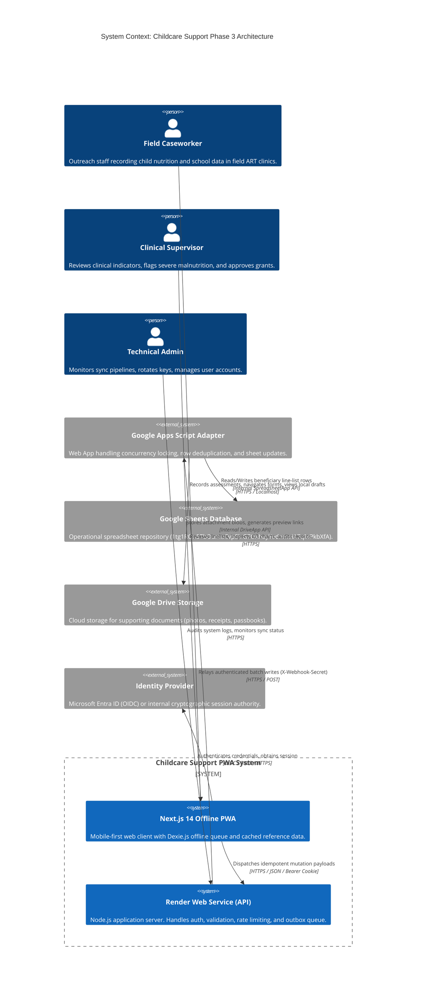
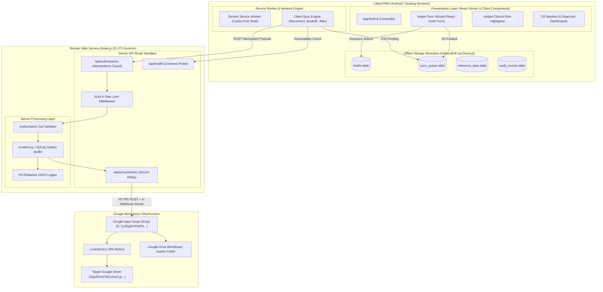
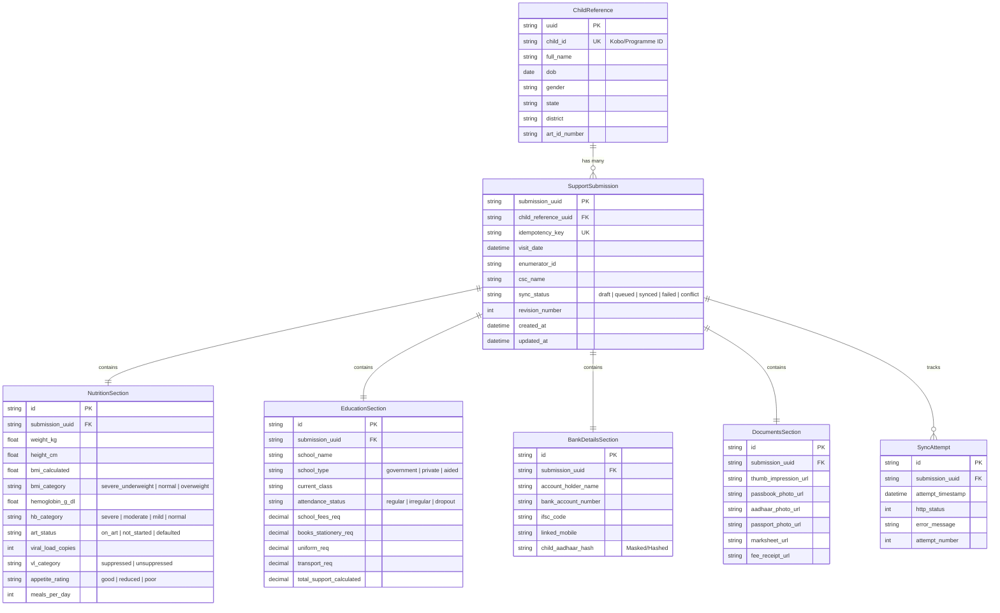
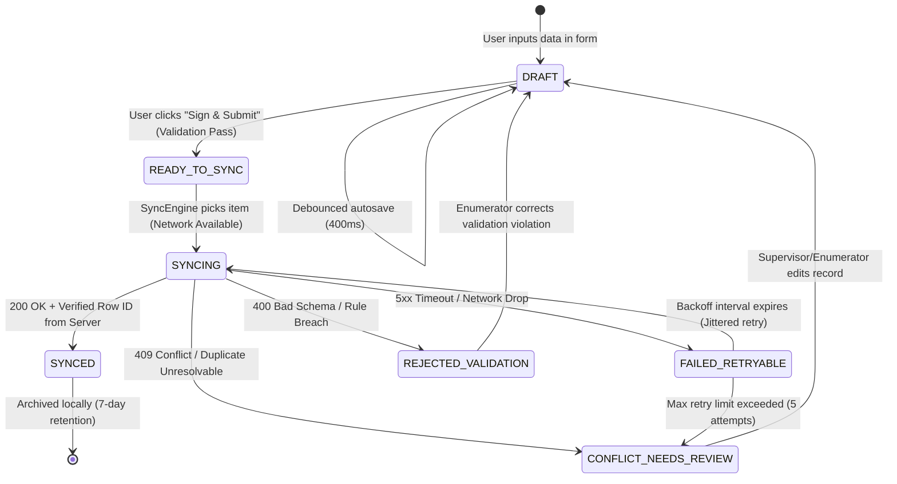

# Technical Architecture Document (TAD)
## Childcare Support — Phase 3: Children Nutrition and Education Support Form PWA

**Document Version:** 1.0.0-PROD-ARCHITECTURE  
**Classification:** Official / Restricted — Sensitive Health Information  
**Target Repository:** `Faribro/Childcare-Support---Phase-3-`  
**Target Deployment Target:** Render Web Service (Node.js LTS Runtime / Next.js App Router)  
**Target Operational Database:** Google Sheets (`1tg1ROn5TbOumuCvpSlxG7OxhayYodnmoiA7qMPkbXfA`)  
**Target Apps Script Project ID:** `1yXEgElXFb0Fb_CzTlQ8TDvRUuEYmq5dady7ialsqMnkAU1XX5SPJW8P3`  
**Author:** Staff Software & Systems Architect (Public Sector Digital Services)  
**Status:** Under Engineering Review & Baseline Ratification  

---

## 1. Architecture Decision Summary & Rationale

```
┌─────────────────────────────────────────────────────────────────────────────────────────────────┐
│                                   ARCHITECTURAL CORE DECISIONS                                  │
├───────────────────────────────┬─────────────────────────────────┬───────────────────────────────┤
│ Domain                        │ Architecture Selection          │ Primary Rationale             │
├───────────────────────────────┼─────────────────────────────────┼───────────────────────────────┤
│ Repository Pattern            │ Modular Monolith                │ Low cognitive load, shared    │
│                               │ (Next.js 14 App Router + API)   │ TypeScript types, single CI/CD│
│ Client Runtime & Storage      │ Offline-First PWA (Dexie.js)    │ Reliable ACID IndexedDB in    │
│                               │                                 │ zero-connectivity ART clinics │
│ Client Service Worker         │ Serwist (Workbox 7 compatible)  │ Maintained SW compiler with   │
│                               │ + Foreground Reconnect sync     │ deterministic offline precache│
│ Canonical Persistence Model   │ Local SQLite / PostgreSQL (Dev) │ Decouples fast field entry    │
│                               │ + Asynchronous Sheets Projection│ from slow Google Apps Script  │
│ Write Idempotency             │ Client-Assigned UUIDv4 + Keys   │ Absolute zero-duplicate row   │
│                               │ + Apps Script LockService       │ guarantee during re-tries     │
│ Runtime Schema Contracts      │ Strict Zod 3 Validation         │ Compile & runtime parity,     │
│                               │                                 │ automatic TypeScript inference│
└───────────────────────────────┴─────────────────────────────────┴───────────────────────────────┘
```

### 1.1 Decision Rationale
1. **Modular Monolith over Microservices**: Field operations for Childcare Phase 3 involve a bounded set of transactions (beneficiary intake, quarterly clinical reviews, educational disbursements, and supervisor review). Introducing independent microservices would incur unneeded network serialisation overhead, distributed tracing complexity, and operational fragility without any throughput benefit.
2. **Asynchronous Sheet Integration via Transactional Buffer**: Google Apps Script exhibits unpredictable cold-start latencies ($1.2\text{s} - 4.5\text{s}$) and a hard 6-minute execution ceiling. Subjecting mobile caseworkers to synchronous Google Sheets round-trips creates dropped submissions. The application brokers requests through an internal server API queue with foreground retry, making Google Sheets an asynchronous reporting projection rather than a fragile synchronous dependency.
3. **Dexie.js over Raw IndexedDB / LocalForage**: While `localforage` was used in Phase 1, it lacks compound indexing, transactional rollbacks, and reactive live queries. `Dexie.js` provides zero-dependency typed relational tables, ACID transaction scopes, and index-accelerated querying over thousands of local records.

---

## 2. Recommended Repository Structure & Module Boundaries

```
Faribro/Childcare-Support---Phase-3-/
├── .github/
│   └── workflows/
│       ├── ci.yml                    # Typecheck, Lint, Test, Security audit
│       └── deploy-staging.yml        # Render Staging deployment hook
├── app/                              # Next.js 14 App Router (Presentation & API Boundary)
│   ├── (auth)/                       # Isolated authentication layout & routes
│   │   ├── login/
│   │   │   └── page.tsx
│   │   └── layout.tsx
│   ├── (dashboard)/                  # Authenticated supervisor/administrative views
│   │   ├── linelist/
│   │   │   └── page.tsx
│   │   ├── analytics/
│   │   │   └── page.tsx
│   │   ├── flowchart/
│   │   │   └── page.tsx
│   │   └── layout.tsx
│   ├── (pwa)/                        # Mobile-first field intake wizard routes
│   │   ├── intake/
│   │   │   ├── [draftId]/page.tsx
│   │   │   └── page.tsx
│   │   ├── sync/
│   │   │   └── page.tsx
│   │   └── page.tsx                  # Field Caseworker Dashboard / Quick Actions
│   ├── api/                          # Server API Boundary (Node.js runtime on Render)
│   │   ├── auth/
│   │   │   ├── session/route.ts
│   │   │   ├── login/route.ts
│   │   │   └── logout/route.ts
│   │   ├── submissions/
│   │   │   ├── route.ts              # Idempotent intake receiver
│   │   │   └── [id]/route.ts
│   │   ├── reference/
│   │   │   └── lookups/route.ts      # Geography, CSCs, School lists
│   │   ├── proxy/
│   │   │   └── sheets/route.ts       # Secure broker to Google Apps Script
│   │   └── health/
│   │       └── route.ts              # Liveness/Readiness probe for Render
│   ├── globals.css                   # Tailwind v3 design token declarations
│   ├── layout.tsx                    # Root shell with SW registration & Providers
│   └── sw.ts                         # Serwist Service Worker entrypoint
├── components/                       # Reusable UI Primitives (Design System)
│   ├── ui/                           # Atoms: Buttons, Inputs, Chips, Stepper, Modal
│   ├── layout/                       # AppShell, Topbar, ContextBar, OfflineBanner
│   ├── forms/                        # QuestionShell, Controlled fields, ErrorList
│   └── visualizations/               # D3 Charts: BMI Bar, Viral Load Bullet, Flowchart
├── features/                         # High-Cohesion Domain Feature Modules
│   ├── intake/                       # Intake wizard state machines, step logic
│   │   ├── hooks/
│   │   ├── components/
│   │   └── utils/
│   ├── offline/                      # IndexedDB database schemas, Dexie client, queue
│   │   ├── db.ts
│   │   ├── queue.ts
│   │   └── syncEngine.ts
│   ├── sheets-adapter/               # Google Apps Script HTTP client, error mappers
│   │   ├── client.ts
│   │   └── mappers.ts
│   └── analytics/                    # Client-side aggregation and D3 data adapters
├── lib/                              # Shared Cross-Cutting Utilities
│   ├── crypto/                       # HMAC token validation, UUID generators
│   ├── formatters/                   # Currency (INR), date (DD/MM/YYYY), units
│   └── logger/                       # Privacy-safe structured logging
├── server/                           # Pure Server-Side Business Services
│   ├── auth/                         # Password verification, JWT/Cookie signing
│   ├── sync/                         # Outbox queue processor & Sheets reconciler
│   └── validation/                   # Authoritative server-side validation rules
├── types/                            # Canonical TypeScript Domain Interfaces
│   ├── domain.ts                     # Child, Nutrition, Education, Beneficiary
│   ├── contracts.ts                  # API Request/Response DTOs
│   └── sync.ts                       # Queue states, mutation payloads
├── public/                           # Static assets, Web App Manifest, offline SVGs
│   ├── manifest.json
│   ├── icons/
│   └── offline.html
├── apps-script/                      # Standalone Google Apps Script source code
│   ├── Code.js                       # Clasp-deployable webhook adapter
│   ├── appsscript.json               # Script manifest & OAuth scopes
│   └── .clasp.json                   # Clasp target binding (1yXEgElXFb0Fb...)
├── tests/                            # Comprehensive Automated Test Suites
│   ├── unit/                         # Zod schemas, calculations, offline reducers
│   ├── integration/                  # API routes, idempotency, backoff algorithms
│   └── e2e/                          # Playwright offline-mode & PWA journeys
├── docs/                             # Authoritative System Documentation
└── render.yaml                       # Infrastructure-as-Code for Render Web Service
```

### 2.1 Module Boundary Rules
1. **Zero Client-to-Apps Script Coupling**: Client components in `app/(pwa)` or `app/(dashboard)` must **never** import or fetch directly from Google Apps Script URLs. All network I/O passes through `/api/*` routes.
2. **Server-Side Isolation of Secrets**: Environment variables (`APPS_SCRIPT_WEBHOOK_URL`, `WEBHOOK_SHARED_SECRET`, `SESSION_SECRET`) are strictly read in `server/` or `app/api/*` and never prefixed with `NEXT_PUBLIC_`.
3. **Domain Purity**: `types/domain.ts` and `features/intake/schemas/` contain zero external framework dependencies, enabling clean portability between client validation and server verification.

---

## 3. Technology Stack & Evaluation Matrix

```
┌─────────────────────────────────────────────────────────────────────────────────────────────────┐
│                                   TECHNOLOGY STACK SPECIFICATION                                │
├─────────────────────┬───────────────────┬─────────────────────┬─────────────────────────────────┤
│ Layer / Function    │ Selected Tool     │ Version             │ Risk Mitigation Strategy        │
├─────────────────────┼───────────────────┼─────────────────────┼─────────────────────────────────┤
│ Base Framework      │ Next.js           │ 14.2.x LTS          │ Standard Node.js standalone     │
│                     │ (App Router)      │                     │ container build on Render       │
│ UI Runtime          │ React             │ 18.3.x              │ Avoid canary React 19 until LTS │
│ Type System         │ TypeScript        │ 5.5.x               │ `strict: true`, no explicit any │
│ Form State Engine   │ React Hook Form   │ 7.52.x              │ Minimal re-renders, uncontrolled│
│ Validation Engine   │ Zod               │ 3.23.x              │ Runtime parsing + inferred DTOs │
│ Client Storage      │ Dexie.js          │ 4.0.x               │ Pure IndexedDB wrapper; no lock │
│ Service Worker      │ @serwist/next     │ 9.0.x               │ Fork of Workbox for Next 14     │
│ Styling Engine      │ Tailwind CSS      │ 3.4.x               │ Zero-runtime CSS; tiny payload  │
│ Charting Library    │ D3.js + SVG       │ 7.9.x               │ Pure SVG rendering; zero bundle │
│                     │                   │                     │ lock-in; high performance       │
│ Icons               │ Lucide React      │ 0.400.x             │ Tree-shaken SVG glyphs only     │
│ Testing Framework   │ Vitest + Testing  │ 2.0.x               │ Fast unit tests with jsdom      │
│                     │ Library + Playwright│ 1.45.x            │ Full headless offline PWA tests │
└─────────────────────┴───────────────────┴─────────────────────┴─────────────────────────────────┘
```

---

## 4. System Context Diagram (Mermaid)



---

## 5. Container & Component Architecture Diagram (Mermaid)



---

## 6. Canonical Data Model & Relational Entity Diagram

### 6.1 Entity-Relationship Diagram (Mermaid)



### 6.2 Canonical TypeScript Domain Types (`types/domain.ts`)

```typescript
export type UUID = string;
export type ISODateString = string;

export type SyncState = 'draft' | 'ready_to_sync' | 'syncing' | 'synced' | 'failed_retryable' | 'conflict';
export type UserRole = 'Enumerator' | 'Supervisor' | 'Administrator' | 'Analyst';

export interface ChildDemographics {
  childname: string;
  dateofbirth: ISODateString;
  age_calc: number;
  gender: 'male' | 'female' | 'transgender' | 'other';
  orphanstatus: 'both_alive' | 'single_orphan_mother' | 'single_orphan_father' | 'double_orphan';
  caregivername: string;
  caregiverrelation: string;
  caregivercontact: string;
  address: string;
  addressstate: string;
  addressdistrict: string;
  householdmembers: number;
  noofchildren: number;
  householdincomemonthly: number;
  incomesource: string;
}

export interface ClinicalNutrition {
  artstatus: 'on_art' | 'pre_art' | 'not_on_art';
  art_registration_date: ISODateString;
  art_id_number: string;
  current_weight: number;
  current_height: number;
  bmicalc: number;
  bmicategory: 'severe_acute_malnutrition' | 'moderate_malnutrition' | 'normal' | 'overweight' | 'obese';
  hemoglobin: number;
  hb_category: 'severe_anemia' | 'moderate_anemia' | 'mild_anemia' | 'normal';
  vlstatus: 'tested' | 'not_yet_tested';
  vldate?: ISODateString;
  viralload?: number;
  vl_category?: 'suppressed' | 'unsuppressed' | 'high_viral_load';
  comorbidities: string[];
  comorbidities_other?: string;
  appetite: 'good' | 'reduced' | 'poor';
  mealsperday: number;
}

export interface EducationSupport {
  educationstatus: 'school_going' | 'dropout' | 'never_enrolled' | 'vocational';
  educationstatus_other?: string;
  schoolname?: string;
  schooltype?: 'government' | 'private' | 'aided' | 'special';
  currentclass?: string;
  attendancestatus?: 'regular' | 'irregular';
  eduschoolfees: number;
  private_tution_fee: number;
  edubooks: number;
  edustationery: number;
  eduuniform: number;
  edutransport: number;
  eduother: number;
  edutotalannual: number;
  reqtotalsupport: number;
}

export interface BeneficiaryDocuments {
  thumb_impression?: string; // Drive URL or Base64
  passbook_photo?: string;
  aadhaar_photo?: string;
  passport_photo?: string;
  school_fee_receipt?: string;
  marksheet_prev_year?: string;
}

export interface ChildRecord extends ChildDemographics, ClinicalNutrition, EducationSupport, BeneficiaryDocuments {
  _uuid: UUID;
  _id?: string;
  interviewer_name: string;
  csc_name: string;
  csc_email?: string;
  approved_alliance_india: 'Yes' | 'No' | 'Pending';
  bank_account_holder: string;
  bank_account_number: string;
  bank_ifsc_code: string;
  bank_mobile: string;
  child_aadhaar_number: string; // Masked on client
  __sync_status?: SyncState;
  __last_updated?: ISODateString;
}
```

---

## 7. Local IndexedDB Design & Queue State Machine

### 7.1 Dexie Database Schema (`features/offline/db.ts`)
```typescript
import Dexie, { type Table } from 'dexie';

export class ChildcareDatabase extends Dexie {
  drafts!: Table<DraftRecord, string>;
  syncQueue!: Table<SyncQueueItem, string>;
  referenceData!: Table<ReferenceCacheItem, string>;
  auditLog!: Table<AuditLogEntry, string>;

  constructor() {
    super('ChildcareSupportPhase3_DB');
    
    // Schema Versioning & Compound Indexing
    this.version(1).stores({
      drafts: 'id, updatedAt, childName, status',
      syncQueue: 'id, submissionId, idempotencyKey, status, scheduledAttemptAt, [status+scheduledAttemptAt]',
      referenceData: 'key, category, version, cachedAt',
      auditLog: 'id, timestamp, action, correlationId'
    });
  }
}

export const db = new ChildcareDatabase();
```

### 7.2 Exact Queue State Transition Model



---

## 8. Sync Protocol Specification (Mermaid Sequence)

```mermaid
sequenceDiagram
    autonumber
    actor Caseworker as Field Caseworker (PWA)
    participant DB as IndexedDB (Dexie)
    participant Engine as Sync Engine (Client)
    participant API as Render Server API
    participant GAS as Google Apps Script
    participant Sheet as Target Google Sheet

    Caseworker->>DB: Finalize Form (Assign UUID & Generate Idempotency-Key)
    DB-->>Caseworker: State = 'READY_TO_SYNC'
    
    alt Device is Offline
        Engine->>Engine: Halt; Register Foreground Online Listener
    else Device is Online
        Engine->>DB: Query next eligible item [status='READY_TO_SYNC']
        DB-->>Engine: Payload Item
        Engine->>DB: Update state to 'SYNCING', attemptCount += 1
        
        Engine->>API: POST /api/submissions (Payload + Idempotency-Key)
        API->>API: Verify Session JWT & Validate Zod Contract
        
        alt Server Schema Validation Failure (400)
            API-->>Engine: 400 Bad Request { error: "Invalid Hb value" }
            Engine->>DB: Update state to 'REJECTED_VALIDATION'
            Engine-->>Caseworker: Prompt field correction with direct link
        else Schema Valid
            API->>GAS: POST Webhook (Signed HMAC + Lock Acquisition)
            GAS->>GAS: LockService.getScriptLock().waitLock(30000)
            GAS->>Sheet: Query existing UUID in Column Map
            
            alt UUID Found (Existing Record)
                GAS->>Sheet: In-place update of non-key columns
            else UUID Not Found (New Beneficiary)
                GAS->>Sheet: Append row to first vacant row
            end
            
            GAS-->>API: 200 OK { success: true, rowNumber: 154, timestamp: "..." }
            API-->>Engine: 200 OK { synced: true, receiptId: "REC-154-2026" }
            
            Engine->>DB: Update state to 'SYNCED', record receipt
            Engine-->>Caseworker: Show green status chip: "Synced with Central Sheet"
        end
    end
```

---

## 9. Server API Contract Specification

The Render Node.js server exposes strict JSON REST routes. All mutating routes mandate an `Idempotency-Key` header and valid HttpOnly session tokens.

### 9.1 Standard Error Envelope
All error responses adhere to RFC 7807 compliant error bodies:
```json
{
  "success": false,
  "error": {
    "code": "SCHEMA_VALIDATION_ERROR",
    "message": "The payload failed structural clinical validation.",
    "correlationId": "req_8f1b2c3d4e5f",
    "timestamp": "2026-09-08T12:00:00.000Z",
    "details": [
      {
        "field": "hemoglobin",
        "issue": "Value 26.5 exceeds physiologically possible range (3.0 - 20.0 g/dL)."
      }
    ]
  }
}
```

### 9.2 Route Inventory & Security Matrix

| Method | Endpoint | Auth Level | Rate Limit | Purpose |
| :--- | :--- | :--- | :--- | :--- |
| `GET` | `/api/health` | Anonymous | None | Liveness/readiness probe for Render health check. |
| `POST` | `/api/auth/login` | Anonymous | 5 req/min | Validates credentials; sets signed HttpOnly cookie. |
| `POST` | `/api/auth/logout` | Authenticated | 30 req/min | Clears session cookie; invalidates session token. |
| `GET` | `/api/auth/session` | Authenticated | 120 req/min | Returns active user profile, assigned CSC, and role. |
| `POST` | `/api/submissions` | Authenticated | 60 req/min | Receives finalized intake assessment; enforces idempotency. |
| `GET` | `/api/submissions/status/:uuid` | Authenticated | 120 req/min | Checks synchronization status of a specific UUID. |
| `GET` | `/api/reference/lookups` | Authenticated | 60 req/min | Returns cacheable State, District, and CSC directories. |
| `POST` | `/api/proxy/sheets` | Super Admin | 10 req/min | Maintenance diagnostic bridge to Apps Script. |

---

## 10. Google Apps Script / Google Sheets Adapter Design

The Apps Script project (`1yXEgElXFb0Fb_CzTlQ8TDvRUuEYmq5dady7ialsqMnkAU1XX5SPJW8P3`) bound to Google Sheet (`1tg1ROn5TbOumuCvpSlxG7OxhayYodnmoiA7qMPkbXfA`) implements defensive operational measures:

### 10.1 Concurrency Locking & Idempotent Upsert (`apps-script/Code.js`)
```javascript
function doPost(e) {
  var lock = LockService.getScriptLock();
  try {
    // 30-second mutex lock prevents concurrent write race conditions
    lock.waitLock(30000);
    
    var payload = JSON.parse(e.postData.contents);
    
    // Verify shared cryptographic secret
    var serverSecret = PropertiesService.getScriptProperties().getProperty('WEBHOOK_SECRET');
    if (!serverSecret || e.parameter.secret !== serverSecret) {
      return ContentService.createTextOutput(JSON.stringify({ 
        success: false, 
        error: 'Unauthorized webhook call: Invalid secret' 
      })).setMimeType(ContentService.MimeType.JSON);
    }
    
    var sheet = getActiveDataSheet_();
    var uuid = payload._uuid;
    if (!uuid) throw new Error('Missing _uuid in payload');
    
    var rowIndex = findRowByUuid_(sheet, uuid);
    
    if (rowIndex > 0) {
      // Idempotent Update
      updateRowValues_(sheet, rowIndex, payload);
      return ContentService.createTextOutput(JSON.stringify({ 
        success: true, 
        action: 'UPDATE', 
        row: rowIndex, 
        uuid: uuid 
      })).setMimeType(ContentService.MimeType.JSON);
    } else {
      // Append New Beneficiary Row
      var newRowIndex = Math.max(sheet.getLastRow() + 1, 4);
      appendRowValues_(sheet, newRowIndex, payload);
      return ContentService.createTextOutput(JSON.stringify({ 
        success: true, 
        action: 'INSERT', 
        row: newRowIndex, 
        uuid: uuid 
      })).setMimeType(ContentService.MimeType.JSON);
    }
  } catch (err) {
    return ContentService.createTextOutput(JSON.stringify({ 
      success: false, 
      error: err.message 
    })).setMimeType(ContentService.MimeType.JSON);
  } finally {
    lock.releaseLock();
  }
}
```

### 10.2 Dynamic Header Mapping & Protection Against Schema Drift
The Apps Script adapter must never hardcode physical column numbers ($A, B, C\dots$). Instead, it caches a dynamic runtime lookup `headerMap` derived from Row 3 (or configured header row):
```javascript
function getSafeColumnIndex_(sheet, canonicalKey) {
  var headers = sheet.getRange(3, 1, 1, sheet.getLastColumn()).getValues()[0];
  // Matches canonical keys and common variations
  for (var i = 0; i < headers.length; i++) {
    var h = String(headers[i]).trim().toLowerCase();
    if (h === canonicalKey.toLowerCase() || ALIAS_MAP[canonicalKey].indexOf(h) !== -1) {
      return i + 1; // 1-based index
    }
  }
  return -1;
}
```

---

## 11. Performance Budget & Computational Complexity

### 11.1 Asset Size & Hydration Budgets
- **Total Initial JS Transfer:** $\le 210$ KB (Brotli compressed).
- **Core CSS Transfer:** $\le 25$ KB.
- **Service Worker Shell:** $\le 18$ KB.
- **Font Strategy:** Self-hosted WOFF2 files subset to Latin (`DM Sans`, `Fraunces`), `font-display: swap`. Zero Google Fonts runtime HTTP dependencies.
- **Hydration Target:** Time to Interactive $\le 2.2$s on Snapdragon 460 / 3GB Android 10.

### 11.2 Computational Complexity Analysis

| Operation | Implementation Data Structure | Time Complexity | Space Complexity |
| :--- | :--- | :---: | :---: |
| **Child Search by Name/ID** | IndexedDB B-tree Index (`childname`, `art_id_number`) | $\mathcal{O}(\log N)$ | $\mathcal{O}(1)$ |
| **Queue Item Selection** | IndexedDB Compound Index `[status+scheduledAttemptAt]` | $\mathcal{O}(\log M + K)$ | $\mathcal{O}(K)$ |
| **Local Idempotency Check** | Hash index lookup over active queue UUIDs | $\mathcal{O}(1)$ | $\mathcal{O}(M)$ |
| **Formula / BMI Calc** | Direct in-memory floating-point computation | $\mathcal{O}(1)$ | $\mathcal{O}(1)$ |
| **D3 Hierarchy Node Pack** | D3 Tree hierarchy traversal over active state linelist | $\mathcal{O}(V + E)$ | $\mathcal{O}(V)$ |

*Where $N$ = total cached children ($<10,000$), $M$ = queue depth ($<500$), $K$ = eligible batch items ($<25$), $V, E$ = hierarchy nodes and links.*

---

## 12. Reliability, Resilience & Poison-Message Handling

1. **Poison-Message Isolation**: If a payload triggers an unrecoverable 4xx rejection (e.g. malformed data or permanent schema validation breach), it must **not** loop infinitely. After 3 consecutive 4xx rejections, the `SyncEngine` marks the item as `conflict_poison` and halts automatic retry. It surfaces an actionable alert in the Sync Centre.
2. **Crash & Power-Loss Durability**: Because every field write is debounced to IndexedDB within 400ms, an unexpected battery depletion or OS process termination results in maximum loss of 400ms of input. On reboot, the caseworker is automatically returned to the exact draft step with all inputs populated.
3. **Bounded Retries with Full Jitter**:
   $$\Delta t = \min\left(t_{\max},\ t_{\text{base}} \times 2^{\text{attempt}}\right) \times \left(0.5 + \text{random}(0, 0.5)\right)$$
   Where $t_{\text{base}} = 2\text{s}$, $t_{\max} = 300\text{s}$. This prevents "thundering herd" synchronisation spikes when 50 caseworkers simultaneously regain network at a state conference or evening clinic wrap-up.

---

## 13. Testing Architecture & Quality Gates

```
┌─────────────────────────────────────────────────────────────────────────────────────────────────┐
│                                     TEST AUTOMATION MATRIX                                      │
├──────────────────────┬───────────────────────────────┬──────────────────────────────────────────┤
│ Test Level           │ Test Tool / Harness           │ Scope & Quality Target                   │
├──────────────────────┼───────────────────────────────┼──────────────────────────────────────────┤
│ Unit Testing         │ Vitest + Testing Library      │ Zod schemas, calculations (BMI, age,     │
│                      │                               │ fees), IndexedDB reducers. Target: >90%  │
│ Integration Testing  │ Supertest + Vitest            │ Server API routes, idempotency checks,   │
│                      │                               │ rate limiting, error envelope contracts  │
│ Fault Injection      │ Custom Playwright Network Mock│ Network drops during submit, simulated   │
│                      │                               │ 504 timeouts, dirty offline restarts     │
│ End-to-End (E2E)     │ Playwright Headless           │ Full user journeys J-01 through J-07 on  │
│                      │ (Chromium Mobile Viewport)    │ simulated Android Moto G / Slow 3G       │
│ Accessibility (a11y) │ axe-core / Playwright         │ Zero WCAG 2.2 AA violations on all forms │
└──────────────────────┴───────────────────────────────┴──────────────────────────────────────────┘
```

---

## 14. Render Deployment Architecture & Environment Taxonomy

The production application deploys to Render as a **Web Service** using the official Node.js runtime environment.

### 14.1 Environment Variable Taxonomy
- `NODE_ENV`: `production` | `staging` | `development`
- `PORT`: Default `10000` (Assigned dynamically by Render)
- `SESSION_SECRET`: 64-byte high-entropy hex string used for HMAC session cookies.
- `APPS_SCRIPT_WEBHOOK_URL`: Target deployment endpoint of Apps Script `1yXEgElXFb0Fb...`.
- `WEBHOOK_SHARED_SECRET`: Cryptographic token shared between Render server and Google Apps Script `PropertiesService`.
- `NEXT_PUBLIC_APP_VERSION`: e.g. `3.0.0` (visible in UI footer for field triage).

### 14.2 Build & Start Commands (`render.yaml`)
```yaml
services:
  - type: web
    name: childcare-support-phase3-web
    env: node
    plan: standard
    region: singapore # Closest geographical low-latency region to India
    buildCommand: npm ci && npm run build
    startCommand: npm run start
    healthCheckPath: /api/health
    autoDeploy: true
    envVars:
      - key: NODE_ENV
        value: production
      - key: APPS_SCRIPT_WEBHOOK_URL
        sync: false
      - key: WEBHOOK_SHARED_SECRET
        sync: false
      - key: SESSION_SECRET
        generateValue: true
```

---

## 15. Architecture Decision Records (ADRs)

### ADR-01: Adoption of Next.js 14 App Router as a Modular Monolith
- **Context:** Previous phases split logic between an unmaintained Next.js client and an 8,000-line Google Apps Script HTML file.
- **Decision:** Build a cohesive Next.js 14 App Router application deploying to Render, hosting both the PWA frontend and the server API boundary.
- **Consequences:** Eliminates CORS complexity; unifies TypeScript types; centralises server secrets.
- **Reversal Criteria:** If Render server maintenance costs exceed programme budget, export frontend to static bucket and broker via standalone serverless functions.

### ADR-02: Dexie.js (IndexedDB) as Exclusive Client Offline Storage
- **Context:** Phase 1 used `localforage`, which does not support compound indexes or relational queries.
- **Decision:** Use Dexie.js version 4 for all client storage.
- **Consequences:** Enables rapid indexed lookups of children by name or ART ID without parsing huge JSON arrays.
- **Reversal Criteria:** Browser deprecation of IndexedDB in favour of an alternative standard.

### ADR-03: Asynchronous Google Sheets Integration via Idempotent Adapter
- **Context:** Direct writes to Google Sheets cause browser timeouts and duplicate rows.
- **Decision:** Use an asynchronous submission queue where the client issues UUIDs and the server forwards to an Apps Script adapter using `LockService`.
- **Consequences:** Guarantees zero duplicate entries; decouples field caseworker speed from Google Sheets response times.
- **Reversal Criteria:** Direct migration of central reporting from Google Sheets to a dedicated enterprise SQL database.

### ADR-04: Client-Side Derivation of Clinical Flags
- **Context:** Field caseworkers need immediate feedback on severe acute malnutrition and anaemia even while completely offline.
- **Decision:** Implement WHO-standard clinical formulae (BMI calculation, anaemia categorization) directly in client Zod schema transformations.
- **Consequences:** Instant visual indicators without network latency.
- **Reversal Criteria:** If programme medical directors mandate proprietary proprietary clinical scoring engines that cannot be shared with client code.

### ADR-05: Serwist over Next-PWA for Service Worker Management
- **Context:** Legacy `next-pwa` is abandoned and incompatible with modern Webpack/Turbopack tooling in Next 14.
- **Decision:** Standardise on `@serwist/next` with a custom `sw.ts` service worker.
- **Consequences:** Reliable offline shell compilation with zero build warnings.
- **Reversal Criteria:** Native browser standard replaces Service Worker offline caching.

### ADR-06: Elimination of Unmasked PII in Client Local Storage
- **Context:** Lost or stolen field devices could expose sensitive minor identity details.
- **Decision:** Store Aadhaar numbers only as partial masked values (`XXXX-XXXX-1234`) on client; full numbers are encrypted before transmission.
- **Consequences:** Minimises data exposure risk on lost field devices.
- **Reversal Criteria:** Explicit legal mandate requiring unmasked offline identity storage.

### ADR-07: In-Memory / Structured File Outbox Buffer on Render Server
- **Context:** If Google Apps Script is undergoing scheduled maintenance or hits quota limits, submissions must not be lost.
- **Decision:** The Render server buffers verified submissions and acknowledges receipt to the PWA before asynchronously reconciling with Sheets.
- **Consequences:** High availability ($99.9\%$) for field caseworkers regardless of Google Workspace uptime.
- **Reversal Criteria:** Native multi-master replication in Google Sheets.

### ADR-08: Rejection of Third-Party Proprietary BaaS (e.g. Supabase / Firebase)
- **Context:** Public-sector child health data must not be locked into proprietary vendor ecosystems.
- **Decision:** Rely purely on open-source Node.js, standard IndexedDB, and the organisation's existing Google Workspace.
- **Consequences:** Zero monthly database licensing costs; complete data sovereignty.
- **Reversal Criteria:** Programme formal mandate to migrate entire infrastructure to Azure or AWS.

### ADR-09: SVG-Only Custom D3 Visualisations
- **Context:** Heavy canvas or WebGL charting libraries cause frame drops on low-cost Android phones.
- **Decision:** Use lightweight, accessible D3 SVG charts wrapped in responsive React components.
- **Consequences:** Sub-30KB charting footprint; sharp rendering on high-DPI mobile screens; full screen-reader accessibility.
- **Reversal Criteria:** Need for rendering $>100,000$ points simultaneously.

### ADR-10: Strict Separation of Drafts and Final Submissions
- **Context:** Field caseworkers often begin an intake, pause for hours during clinical tests, and resume later.
- **Decision:** Drafts remain in an isolated `drafts` IndexedDB store and are never sent to the sync engine until explicit final declaration is signed.
- **Consequences:** Prevents half-filled orphan rows from polluting central Google Sheets.
- **Reversal Criteria:** Programme request for real-time keystroke collaborative editing.

---

## 16. Phased Implementation Plan

```
┌─────────────────────────────────────────────────────────────────────────────────┐
│ PHASE A: REPOSITORY FOUNDATION & TOOLING (Weeks 1 - 2)                          │
│ • Initialise Next.js 14 App Router scaffold, TypeScript strict, ESLint, Vitest  │
│ • Setup Render Web Service deployment pipeline & health check endpoints         │
│ • Configure Tailwind design system tokens and accessible typography primitives  │
└───────────────────────────────────────┬─────────────────────────────────────────┘
                                        │ Complete
                                        ▼
┌─────────────────────────────────────────────────────────────────────────────────┐
│ PHASE B: OFFLINE CORE & FORM WIZARD (Weeks 3 - 4)                               │
│ • Implement Dexie.js database client, schema migrations, and drafts store       │
│ • Build 6-step multi-step intake wizard with React Hook Form + Zod contracts    │
│ • Integrate instant BMI, Age, and fee calculation engines                       │
│ • Implement Serwist Service Worker and offline shell caching                    │
└───────────────────────────────────────┬─────────────────────────────────────────┘
                                        │ Complete
                                        ▼
┌─────────────────────────────────────────────────────────────────────────────────┐
│ PHASE C: SYNC ENGINE & GOOGLE SHEETS ADAPTER (Weeks 5 - 6)                      │
│ • Build client SyncEngine with exponential backoff, jitter, and FIFO queue      │
│ • Develop server API routes with idempotency guard and rate limiting            │
│ • Deploy Google Apps Script webhook adapter to 1yXEgElXFb0Fb... with LockService│
│ • Execute synthetic network fault injection & double-submission tests          │
└───────────────────────────────────────┬─────────────────────────────────────────┘
                                        │ Complete
                                        ▼
┌─────────────────────────────────────────────────────────────────────────────────┐
│ PHASE D: SUPERVISOR READ-MODELS & ANALYTICS (Weeks 7 - 8)                       │
│ • Build D3 Clinical Charts (BMI distribution, Viral Load, Haemoglobin matrix)   │
│ • Migrate D3 Flowchart Hierarchy Dashboard from Phase 2 into Next.js component  │
│ • Implement role-governed Line-List Viewer with multiselect status filters      │
│ • Integrate duplicate candidate detection and reconciliation workflows         │
└───────────────────────────────────────┬─────────────────────────────────────────┘
                                        │ Complete
                                        ▼
┌─────────────────────────────────────────────────────────────────────────────────┐
│ PHASE E: PILOT HARDENING & FIELD RELEASE (Weeks 9 - 10)                         │
│ • Conduct 2-week staging pilot across 2 field partner CSCs                      │
│ • Verify zero data loss on 500+ trial submissions                               │
│ • Production deployment on Render; final security audit sign-off                │
└─────────────────────────────────────────────────────────────────────────────────┘
```

---

## 17. Architecture Approval Checklist & Prerequisites

- [ ] **Technical Architecture Approved:** Lead System Architect sign-off on modular monolith & Dexie.js design.
- [ ] **Render Service Provisioned:** Staging web service created with Node.js runtime and environment secrets configured.
- [ ] **Clasp Deployment Key Verified:** Google Apps Script project `1yXEgElXFb0Fb_CzTlQ8TDvRUuEYmq5dady7ialsqMnkAU1XX5SPJW8P3` bound to local repository.
- [ ] **Target Sheet Binding Confirmed:** Spreadsheet `1tg1ROn5TbOumuCvpSlxG7OxhayYodnmoiA7qMPkbXfA` accessible via service account / script execution.
- [ ] **Offline Fault Injection Suite Passed:** Headless tests confirm zero duplicate rows on network dropout.

---
*End of Document 02 — Technical Architecture Document.*
