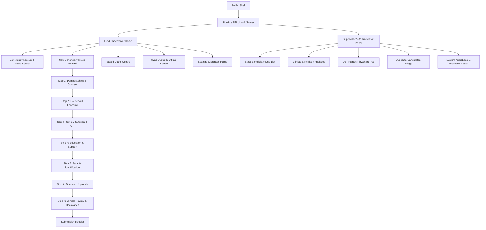

# Frontend Specification Document (FSD)
## Childcare Support — Phase 3: Children Nutrition and Education Support Form PWA

**Document Version:** 1.0.0-UI-SPEC  
**Classification:** Official / Restricted — Design & Engineering Specification  
**Target Repository:** `Faribro/Childcare-Support---Phase-3-`  
**Design Aesthetic:** White-Premium Public Service / Institutional Dignity / High-Legibility Field UI  
**Target Viewports:** Mobile (320px–480px Android), Tablet (768px–1024px), Desktop (1280px+)  
**Author:** Staff Product Designer & Senior Frontend Architect (Antigravity)  
**Status:** Under Design System Ratification & Review  

---

## 1. Brand Intent, Emotional Attributes & Design Strategy

```
┌─────────────────────────────────────────────────────────────────────────────────────────────────┐
│                                       DESIGN PHILOSOPHY                                         │
├───────────────────────┬─────────────────────────────────────┬───────────────────────────────────┤
│ Core Emotional Pillar │ Visual & Interaction Manifestation   │ Anti-Patterns Strictly Prohibited │
├───────────────────────┼─────────────────────────────────────┼───────────────────────────────────┤
│ **Institutional       │ Deep navy headers, calm forest green│ No neon cyberpunk/holographic     │
│ Confidence**          │ accents, pristine off-white surfaces│ HUDs; no gaming scanlines; no dark│
│                       │ with crisp high-contrast typography.│ mode defaults that blind outdoors.│
├───────────────────────┼─────────────────────────────────────┼───────────────────────────────────┤
│ **Clinical Dignity**  │ Serene, neutral clinical presentation│ No alarmist red badges for routine│
│                       │ separating warnings from fatal errors│ nutrition follow-ups; no stigma-  │
│                       │ with thoughtful, respectful copy.   │ inducing diagnostic callouts.     │
├───────────────────────┼─────────────────────────────────────┼───────────────────────────────────┤
│ **Field Speed &       │ Generous 48px touch targets, zero   │ No multi-second spring physics; no│
│ Ergonomics**          │ layout shift, visible offline state,│ tiny clickable link text; no      │
│                       │ high sunlight legibility.           │ nested dropdown traps.            │
└───────────────────────┴─────────────────────────────────────┴───────────────────────────────────┘
```

### 1.1 Visual Differentiation Strategy
The Phase 3 PWA adopts a **White-Premium Public-Service Design Language** inspired by the restraint and clarity of world-class digital civil service systems (e.g. UK GOV.UK, India EPFO, and Singapore Singpass):
- **Base Backdrop:** A tailored warm off-white canvas (`#F8FAFC` to `#FFFFFF`) that eliminates glare and reduces eye strain during long field clinics.
- **Authority Accent:** Deep Institutional Indigo (`#1E3A8A`) and Rich Emerald (`#047857`) for verified clinical actions.
- **Physical Clarity:** High-contrast borders (`#CBD5E1`), structured card enclosures, and tabular data layouts rather than floating borderless cards that confuse users on budget displays.

---

## 2. Design Tokens & Design System Foundations

*Note: All brand colours and typography choices marked as "Provisional pending programme brand approval."*

### 2.1 Colour Tokens (Tailwind Semantic Mappings)

```
┌─────────────────────────────────────────────────────────────────────────────────────────────────┐
│                                       SEMANTIC COLOUR TOKENS                                    │
├───────────────────────┬───────────────────┬──────────────┬──────────────────────────────────────┤
│ Token Name            │ CSS Variable      │ Hex Value    │ Semantic Usage                       │
├───────────────────────┼───────────────────┼──────────────┼──────────────────────────────────────┤
│ `surface-canvas`      │ `--color-canvas`  │ `#F8FAFC`    │ Application main background          │
│ `surface-card`        │ `--color-card`    │ `#FFFFFF`    │ Card, modal, and drawer panels       │
│ `surface-subtle`      │ `--color-subtle`  │ `#F1F5F9`    │ Table headers, input backgrounds     │
│ `text-primary`        │ `--color-ink-900` │ `#0F172A`    │ Headings, primary labels, values     │
│ `text-secondary`      │ `--color-ink-600` │ `#475569`    │ Helper text, captions, metadata      │
│ `text-muted`          │ `--color-ink-400` │ `#94A3B8`    │ Disabled states, placeholders        │
│ `border-default`      │ `--color-slate-300│ `#CBD5E1`    │ Input borders, card dividers         │
│ `border-focus`        │ `--color-focus`   │ `#2563EB`    │ High-contrast focus outline (3px)    │
│ `brand-primary`       │ `--color-brand`   │ `#1E3A8A`    │ Topbar, masthead, primary CTA        │
│ `brand-accent`        │ `--color-emerald` │ `#047857`    │ "Synced", "Approved", success state  │
│ `status-warning`      │ `--color-amber`   │ `#B45309`    │ Clinical alerts, pending sync queue  │
│ `status-danger`       │ `--color-rose`    │ `#BE123C`    │ Fatal validation error, deletion     │
│ `status-info`         │ `--color-sky`     │ `#0369A1`    │ Instructional notes, version badges  │
└───────────────────────┴───────────────────┴──────────────┴──────────────────────────────────────┘
```

### 2.2 Typography Scale & Font Strategy
- **Display & Section Font:** `DM Sans` (Self-hosted WOFF2, geometric modern sans-serif with high legibility).
- **Tabular & Numeric Font:** `DM Mono` (Self-hosted WOFF2, for currencies, Aadhaar masking, and dates).

```
┌─────────────────────────────────────────────────────────────────────────────────────────────────┐
│                                        TYPOGRAPHY TOKENS                                        │
├───────────────┬───────────┬──────────────┬─────────────┬────────────────────────────────────────┤
│ Token         │ Size (px) │ Line Height  │ Weight      │ Usage                                  │
├───────────────┼───────────┼──────────────┼─────────────┼────────────────────────────────────────┤
│ `text-display`│ 28px      │ 36px (1.28)  │ 700 (Bold)  │ Main screen titles, receipt header     │
│ `text-title`  │ 20px      │ 28px (1.40)  │ 700 (Bold)  │ Section cards, modal headers           │
│ `text-heading`│ 16px      │ 24px (1.50)  │ 600 (Semib) │ Form field group titles, table headers │
│ `text-body`   │ 15px      │ 22px (1.46)  │ 400 (Reg)   │ Standard input text, card descriptions │
│ `text-callout`│ 14px      │ 20px (1.42)  │ 500 (Med)   │ Buttons, badge chips, context bar      │
│ `text-caption`│ 12px      │ 16px (1.33)  │ 400 (Reg)   │ Field helper text, timestamps, footer  │
└───────────────┴───────────┴──────────────┴─────────────┴────────────────────────────────────────┘
```

### 2.3 Spacing, Radii, Shadows & Elevation
- **Spacing Scale:** 4px baseline (`p-1` = 4px, `p-2` = 8px, `p-3` = 12px, `p-4` = 16px, `p-6` = 24px, `p-8` = 32px).
- **Border Radii:** Inputs = `rounded-md` (6px); Cards = `rounded-lg` (8px); Modal Panels = `rounded-xl` (12px); Badges = `rounded-full` (9999px).
- **Elevation:** Low-diffusion, crisp public-service shadows:
  - `shadow-sm`: `0 1px 2px 0 rgba(15, 23, 42, 0.05)`
  - `shadow-md`: `0 4px 6px -1px rgba(15, 23, 42, 0.08), 0 2px 4px -2px rgba(15, 23, 42, 0.04)`
  - `shadow-lg`: `0 10px 15px -3px rgba(15, 23, 42, 0.10)`

---

## 3. Accessibility Standards (WCAG 2.2 AA Compliance)

1. **Strict Contrast Compliance**: All standard body copy against white/canvas surfaces guarantees a contrast ratio $\ge 5.2:1$ (exceeding WCAG 2.2 AA's 4.5:1 requirement). Large headers achieve $\ge 8.5:1$.
2. **High-Visibility Keyboard Focus**: Focus ring utilizes a 3px solid `#2563EB` offset by 2px white halo (`outline: 3px solid var(--color-focus); outline-offset: 2px`). Default browser focus rings are never stripped without custom ring replacement.
3. **Touch Target Dimensions**: Every button, radio row, checkbox touch area, and stepper tab measures at least **$48 \times 48$ physical CSS pixels**, preventing mis-taps on motorcycle pillion or bumpy transit field visits.
4. **Accessible Error Summaries & Screen Reader Cues**:
   - Validation failures inject an `aria-live="polite"` summary at the top of the form wizard.
   - Each erroneous field links via `aria-describedby` to its specific error message string.
   - Screen reader users can press `Tab` to navigate directly through invalid fields sequentially.
5. **Reduced Motion Mode**: Respects `prefers-reduced-motion: reduce`. Disables page transitions, accordion slides, and D3 animation durations (drops duration from 750ms to 0ms).

---

## 4. Responsive Strategy & Breakpoint Hierarchy

```
┌─────────────────────────────────────────────────────────────────────────────────────────────────┐
│                                      BREAKPOINT SPECIFICATION                                   │
├──────────────┬──────────────────┬───────────────────────────────────────────────────────────────┤
│ Viewport     │ Width Range      │ Core UI Behavior                                              │
├──────────────┼──────────────────┼───────────────────────────────────────────────────────────────┤
│ **Mobile**   │ 320px – 480px    │ Single-column stacked wizard; bottom sticky action bar;       │
│              │                  │ horizontal scrollable stepper chips; fullscreen modal sheets. │
├──────────────┼──────────────────┼───────────────────────────────────────────────────────────────┤
│ **Tablet**   │ 481px – 1024px   │ 2-column input layouts; persistent context header bar;        │
│              │                  │ side-drawer review panel; inline modal dialogs.               │
├──────────────┼──────────────────┼───────────────────────────────────────────────────────────────┤
│ **Desktop**  │ 1025px+          │ 3-column dense dashboard; left fixed navigation rail;         │
│              │                  │ multi-tier line-list table with sticky column headers.        │
└──────────────┴──────────────────┴───────────────────────────────────────────────────────────────┘
```

---

## 5. Application Information Architecture & Site Map



---

## 6. Detailed Screen Specifications

### 6.1 Screen SCR-01: Field Caseworker Home (`app/(pwa)/page.tsx`)
- **Purpose:** Primary landing screen for outreach caseworkers; displays active centre name, pending draft count, offline sync status, and quick-action buttons.
- **Regions:**
  - *Masthead:* Government/Alliance institutional bar with active CSC name and logged-in caseworker.
  - *Context Bar:* Current network reachability indicator (`Online` in green or `Offline • Working Locally` in amber).
  - *Metric Overview Cards:* (1) Active Local Drafts, (2) Forms Queued for Sync, (3) Synced This Week.
  - *Primary Actions:* "Start New Child Intake" (Large 56px CTA) and "Search Beneficiary".
- **States:**
  - *Empty:* Prompts with friendly illustration: *"No active drafts. Ready to begin field visits."*
  - *Offline:* Sync count card changes to amber with direct button to view offline queue.

### 6.2 Screen SCR-02: Multi-Step Assessment Wizard (`app/(pwa)/intake/page.tsx`)
- **Purpose:** Linear 6-step form wizard for child nutrition and education support intake.
- **Regions:**
  - *Top Progress Stepper:* 6 named step chips with numeric indicators, completion checkmarks, and amber warning counts.
  - *Sticky Autosave Bar:* Displays live saving state: *"Saving to device..."* $\rightarrow$ *"Saved locally at 11:42 AM"*.
  - *Form Body:* Enclosed in a pristine white card with clear section headers and helper explanations.
  - *Bottom Control Rail:* "Previous Step", "Save & Exit as Draft", and "Next Step" buttons.

### 6.3 Screen SCR-03: Review, Sanity Check & Declaration (`intake/review`)
- **Purpose:** Final validation check before assigning a permanent UUID and queueing for sync.
- **Regions:**
  - *Validation Summary Box:* Lists all passed clinical rules and highlights any warnings (e.g. BMI $<16.0$).
  - *Read-Only Data Tree:* Collapsible summary of demographics, clinic metrics, and fee breakdowns.
  - *Sign-off Declaration:* Explicit checkbox stating: *"I confirm that the clinical and school details recorded above have been verified with the caregiver and ART register."*
  - *Action CTA:* "Finalize & Enqueue Submission" (Green full-width button).

### 6.4 Screen SCR-04: Submission Receipt (`app/(pwa)/intake/receipt`)
- **Purpose:** Verifiable confirmation of submission with local timestamp and permanent UUID.
- **Regions:**
  - *Green Checkmark Banner:* *"Assessment Recorded Successfully"*.
  - *Receipt Details:* Displays Child Name, Client UUID, Idempotency Hash, and Sync Status badge (`Synced` or `Saved in Device Queue`).
  - *Actions:* "Start Another Assessment" or "Return to Home".

### 6.5 Screen SCR-05: Offline Sync Centre (`app/(pwa)/sync/page.tsx`)
- **Purpose:** Inspection and management of all queued mutations, failed attempts, and synchronization history.
- **Regions:**
  - *Queue Health Header:* Total items pending, last successful sync timestamp, and "Force Sync Now" button.
  - *Queue Cards:* List of pending items showing Child Name, Time Enqueued, Attempt Count, and Status.
  - *Error Details Drawer:* If an item fails, clicking reveals the exact human-readable server rejection message.

### 6.6 Screen SCR-06: Supervisor Line-List & Analytics (`app/(dashboard)/linelist`)
- **Purpose:** Dense desktop/tablet management view for clinical supervisors.
- **Regions:**
  - *Multiselect Filter Bar:* Filter by State, District, School Type, BMI Category, Approval Status.
  - *Data Table:* High-density table with sticky headers, sorting, pagination, and color-coded status badges.
  - *Actions:* "View Details", "Approve Grant", "Flag for Review", "Download PDF Summary".

---

## 7. Form UX & Interaction Specifications

```
┌─────────────────────────────────────────────────────────────────────────────────────────────────┐
│                                       FORM UX RULES MATRIX                                      │
├───────────────────────┬─────────────────────────────────────┬───────────────────────────────────┤
│ Interaction Area      │ Exact UI Requirement                │ Technical Implementation          │
├───────────────────────┼─────────────────────────────────────┼───────────────────────────────────┤
│ **Autosave Engine**   │ Silent background save every 400ms  │ Debounced `useWatch` hook         │
│                       │ after keystroke stop; zero blocking │ writing to Dexie `drafts` table.  │
├───────────────────────┼─────────────────────────────────────┼───────────────────────────────────┤
│ **Derived Fields**    │ Instantaneous auto-calculation with │ `useMemo` calculation rendering a │
│                       │ read-only visual lock chip          │ grayed chip with lock icon.       │
│                       │ (e.g. Age from DOB, BMI from W/H).  │ Disabled to manual typing.        │
├───────────────────────┼─────────────────────────────────────┼───────────────────────────────────┤
│ **Fee Sanity Guard**  │ If Education Status is "Dropout",   │ Conditional validation rule in Zod;│
│                       │ School/Tuition Fees default to 0 and│ disables fee inputs; shows note:  │
│                       │ inputs are disabled.                │ *"Fees disabled for dropouts."*   │
├───────────────────────┼─────────────────────────────────────┼───────────────────────────────────┤
│ **Currency Inputs**   │ Formatted as Indian Rupees (`₹`)     │ Number input with prepended `₹`   │
│                       │ with automated total sum tallying.  │ adorner; parses strings to int.   │
├───────────────────────┼─────────────────────────────────────┼───────────────────────────────────┤
│ **Date Conventions**  │ Explicit Indian format: DD/MM/YYYY. │ HTML5 date input constrained with │
│                       │ Max date = Today (no future births).│ `max={new Date().toISOString()}`. │
├───────────────────────┼─────────────────────────────────────┼───────────────────────────────────┤
│ **Aadhaar Masking**   │ Captures 12 digits; formats as      │ Custom input formatter showing    │
│                       │ `1234 5678 9012`; blurs to masked.  │ `•••• •••• 9012` on field blur.   │
└───────────────────────┴─────────────────────────────────────┴───────────────────────────────────┘
```

---

## 8. Sync UX & State Presentation Rules

The PWA must **never** mislead a caseworker into believing data is safely stored in central Google Sheets when it only exists on the local device.

```
┌─────────────────────────────────────────────────────────────────────────────────────────────────┐
│                                       SYNC STATE UI BADGES                                      │
├─────────────────────┬──────────────┬───────────────┬────────────────────────────────────────────┤
│ State Key           │ Badge Label  │ Badge Colour  │ User Explanation Copy                      │
├─────────────────────┼──────────────┼───────────────┼────────────────────────────────────────────┤
│ `DRAFT`             │ Draft        │ Slate / Gray  │ *"Working copy saved on this device only"* │
│ `READY_TO_SYNC`     │ Queued       │ Amber / Warm  │ *"Finalized. Will upload when connected"*  │
│ `SYNCING`           │ Uploading... │ Blue / Pulse  │ *"Sending data to central portal..."*      │
│ `SYNCED`            │ Synced       │ Emerald/Green │ *"Safely recorded in central database"*    │
│ `FAILED_RETRYABLE`  │ Retry Scheduled│ Orange      │ *"Connection dropped. Retrying soon..."*   │
│ `CONFLICT`          │ Needs Review │ Rose / Red    │ *"Action required: duplicate ART ID detected"*│
└─────────────────────┴──────────────┴───────────────┴────────────────────────────────────────────┘
```

---

## 9. Reusable Component Inventory (Design System Primitives)

1. **`AppShell`**: Master page wrapper containing institutional masthead, network context bar, and responsive navigation drawer.
2. **`ContextBar`**: Thin 32px utility strip under the header rendering live connection status (`Online`, `Offline • Storing Locally`), current CSC name, and pending sync counter badge.
3. **`OfflineBanner`**: High-contrast amber alert bar appearing when network drops: *"You are offline. Full intake creation and autosave remain active."*
4. **`FormStepper`**: Horizontal progress rail showing 6 steps with completion checkmarks, active focus indicators, and warning badges.
5. **`QuestionShell`**: Standard form field wrapper containing the question title, required asterisk (`*`), optional tooltip explanation, input child, helper text, and validation error slot.
6. **`ValidationSummary`**: Accessible error block rendered at the top of a failed form step with anchor links focusing each invalid input.
7. **`StatusChip`**: Compact semantic pill tag rendering sync status, BMI category, or approval state.
8. **`BeneficiaryCard`**: Mobile-optimized summary card showing child name, age, gender, ART ID, and quick-action menu.
9. **`D3ChartWrapper`**: Responsive SVG container providing automatic ResizeObserver dimensions, accessible HTML table fallbacks, and tooltip portals.

---

## 10. Dashboard Visualisation Specification

The analytical dashboard avoids decorative, unlabelled charts in favour of clinically meaningful indicators:

1. **BMI Categorical Distribution (`BmiBarChart`)**:
   - *Type:* Vertical bar chart with baseline gridlines.
   - *Categories:* Severe Acute Malnutrition ($<16.0$), Moderate Malnutrition ($16.0 - 18.4$), Normal ($18.5 - 24.9$), Overweight ($25.0+$).
   - *Accessible Fallback:* Complete data table rendered below the SVG for screen readers.
2. **Viral Load Suppression Bullet Chart (`ViralLoadBulletChart`)**:
   - *Type:* Horizontal bullet/range chart.
   - *Ranges:* Suppressed ($<1000$ copies/mL) in deep green vs Unsuppressed ($\ge 1000$ copies/mL) in high-contrast rose.
3. **Program Flowchart Hierarchy (`FlowchartDashboard`)**:
   - *Type:* Interactive D3.js collapsible tree.
   - *Cascade:* `National/State` $\rightarrow$ `District` $\rightarrow$ `CSC Partner` $\rightarrow$ `School Node` $\rightarrow$ `Child Case`.
   - *Interaction:* Click to expand/collapse nodes; zoom and pan controls; instant filter by malnutrition severity.

---

## 11. Content Design & Field Language Guidelines

```
┌─────────────────────────────────────────────────────────────────────────────────────────────────┐
│                                   CONTENT DESIGN GUIDELINES                                     │
├────────────────────────────────┬────────────────────────────────────────────────────────────────┤
│ Category                       │ Prescribed Copy Standards                                      │
├────────────────────────────────┼────────────────────────────────────────────────────────────────┤
│ **Tone of Voice**              │ Calm, professional, respectful, clear, supportive.             │
│ **Confirmation Messaging**     │ *"Intake form for [Child Name] has been finalized."*           │
│ **Offline Notices**            │ *"Saved safely to your device. Upload will happen automatically│
│                                │ when connection returns."*                                     │
│ **Error Messages**             │ Specify what went wrong and how to fix it:                     │
│                                │ *"Height must be between 40 cm and 220 cm."*                  │
│ **Things NEVER to Say**        │ Never say: *"Fatal error"*, *"System crashed"*,                │
│                                │ *"HIV Patient recorded"*, or *"Invalid user input"*.           │
│ **Financial Terminology**      │ Always format as Indian Rupees: `₹12,500` (not `12500 INR`).   │
└────────────────────────────────┴────────────────────────────────────────────────────────────────┘
```

---

## 12. Frontend Performance & Asset Strategy

- **Font Strategy:** Self-hosted Latin subset `DM Sans` (400, 500, 700) and `DM Mono` (400, 500) loaded via `@next/font/local`. Zero Google Fonts CDN requests.
- **Icon Strategy:** Tree-shaken SVG imports from `lucide-react`. Zero full font icon packs.
- **Image Strategy:** Beneficiary photos and document scans are converted to compressed WebP thumbnails before preview rendering.
- **Hydration Discipline:** Dynamic imports with skeleton placeholders for heavy D3 visualizations (`next/dynamic` with `ssr: false`).
- **Target Lighthouse Audit Scores:** Performance $\ge 90$, Accessibility = $100$, Best Practices $\ge 95$, PWA = $100$.

---

## 13. Frontend Sign-Off Checklist

- [ ] **WCAG 2.2 AA Verified:** Contrast, keyboard navigation, and focus rings tested with axe-core.
- [ ] **Touch Target Audit:** All clickable elements verified $\ge 48 \times 48$ px on mobile viewports.
- [ ] **Offline Presentation Verified:** Offline banner and local queue badges verified under DevTools offline mode.
- [ ] **No Decorative Charts:** All analytical visualizations include accessible tabular alternatives.
- [ ] **Design Tokens Locked:** Tailwind configuration matches semantic palette tokens exactly.

---
*End of Document 04 — Frontend Specification Document.*
