# Feature Ticket List (FTL)
## Childcare Support — Phase 3: Children Nutrition and Education Support Form PWA

**Document Version:** 1.0.0-TICKETS  
**Classification:** Official / Restricted — Engineering Implementation Plan  
**Target Repository:** `Faribro/Childcare-Support---Phase-3-`  
**Deployment Target:** Render Web Service (Node.js LTS / Next.js)  
**Target Operational Database:** Google Sheets (`1tg1ROn5TbOumuCvpSlxG7OxhayYodnmoiA7qMPkbXfA`)  
**Target Apps Script Project ID:** `1yXEgElXFb0Fb_CzTlQ8TDvRUuEYmq5dady7ialsqMnkAU1XX5SPJW8P3`  
**Author:** Senior Engineering & Delivery Lead (Antigravity)  
**Status:** Approved for Dependency-Ordered Execution  

---

## 1. Milestone Roadmap & Topological Dependency Graph

```mermaid
flowchart TD
    subgraph Milestone1 ["Milestone 1: Project Foundation & Deployment"]
        T01["TCK-001: Repo Scaffold & Standards"] --> T02["TCK-002: CI Quality Gates & SAST"]
        T02 --> T03["TCK-003: Render Deployment & Health Probe"]
        T03 --> T04["TCK-004: Sheet Discovery & Schema Gate"]
    end

    subgraph Milestone2 ["Milestone 2: Offline Core & PWA Foundations"]
        T04 --> T05["TCK-005: Canonical Domain Types & Zod Schemas"]
        T05 --> T06["TCK-006: Dexie.js IndexedDB Architecture"]
        T06 --> T07["TCK-007: Serwist PWA Shell & Cache Strategy"]
        T07 --> T08["TCK-008: AppShell & Design System Atoms"]
    end

    subgraph Milestone3 ["Milestone 3: Intake Form Wizard & Drafts Engine"]
        T08 --> T09["TCK-009: Reference Data Cache & Beneficiary Lookup"]
        T09 --> T10["TCK-010: Form Wizard (Demographics & Clinical)"]
        T10 --> T11["TCK-011: Form Wizard (Education, Bank & Uploads)"]
        T11 --> T12["TCK-012: Debounced Autosave & Drafts Centre"]
        T12 --> T13["TCK-013: Clinical Validation & Error Navigation"]
        T13 --> T14["TCK-014: Final Sign-off, UUID & Local Queue"]
    end

    subgraph Milestone4 ["Milestone 4: Synchronisation Bridge & Apps Script Adapter"]
        T14 --> T15["TCK-015: Server API Gateway & Idempotency Filter"]
        T15 --> T16["TCK-016: Apps Script LockService & Sheet Upsert"]
        T16 --> T17["TCK-017: Client SyncEngine (Backoff, Jitter, Retry)"]
        T17 --> T18["TCK-018: Sync Centre UI & Conflict Resolution"]
    end

    subgraph Milestone5 ["Milestone 5: Supervisor Operations & Hardening"]
        T18 --> T19["TCK-019: Supervisor Line-List & Filtering Engine"]
        T19 --> T20["TCK-020: D3 Clinical Visualisations & Flowchart"]
        T20 --> T21["TCK-021: Audit Logging & Security Runbooks"]
        T21 --> T22["TCK-022: Playwright Offline Fault Injection"]
        T22 --> T23["TCK-023: Staging Pilot & Production Verification"]
    end
```



---

## 2. Complete Executable Feature Tickets

---

### TCK-001: Repository Bootstrap & Baseline Standards
- **Priority:** Must-have for pilot
- **Outcome / Value:** Clean Next.js 14 App Router project foundation with strict TypeScript configuration, Tailwind CSS, Vitest, and Prettier.
- **Exact Scope:**
  - Files affected: `package.json`, `tsconfig.json`, `tailwind.config.ts`, `postcss.config.mjs`, `.gitignore`, `vitest.config.ts`.
  - Behaviours: Clean build with `npm run build`, `npm run lint`, `npm run typecheck`, and `npm test`.
  - Non-goals: Implementing form UI or database queries.
- **Dependencies:** None.
- **Technical Notes:** Must use Next.js 14.2.x, React 18.3.x, TypeScript 5.5+ with `strict: true`.
- **Acceptance Criteria:**
  - *Given:* Fresh repository clone.
  - *When:* Developer runs `npm install && npm run build`.
  - *Then:* Build completes with zero warnings or errors and generates standalone `.next` output.
- **Test Plan:** Vitest dummy test passes; TypeScript compilation verifies type assertions.
- **Definition of Done:** Config committed, build succeeds, baseline documentation intact.
- **Antigravity Execution Prompt:**
  ```text
  Implement TCK-001: Bootstrap the Faribro/Childcare-Support---Phase-3- repository with Next.js 14 (App Router, TypeScript strict mode), Tailwind CSS v3, PostCSS, ESLint, and Vitest. Ensure clean package.json scripts for build, dev, lint, typecheck, and test. Verify with npm run build.
  ```

---

### TCK-002: CI Quality Gates & Security Scanning
- **Priority:** Must-have for pilot
- **Outcome / Value:** Automated pull-request verification preventing lint regressions, type mismatches, and committed secrets.
- **Exact Scope:**
  - Files affected: `.github/workflows/ci.yml`.
  - Behaviours: Runs on all PRs to `main`: runs `typecheck`, `lint`, `test`, `audit`, and checks for secret leaks.
  - Non-goals: Automatic production deployment.
- **Dependencies:** `TCK-001`.
- **Technical Notes:** Enforce Node.js 20 LTS runner.
- **Acceptance Criteria:**
  - *Given:* A PR with a TypeScript error.
  - *When:* CI workflow executes.
  - *Then:* The job fails and blocks merging.
- **Test Plan:** Execute GitHub Action locally via `act` or dry-run validation.
- **Definition of Done:** CI workflow file merged and green on baseline commit.
- **Antigravity Execution Prompt:**
  ```text
  Implement TCK-002: Create .github/workflows/ci.yml enforcing linting, typechecking, Vitest testing, and npm security audits on all push and pull_request events to main.
  ```

---

### TCK-003: Render Deployment Foundation & Health Check Route
- **Priority:** Must-have for pilot
- **Outcome / Value:** Verified deployment to Render as a Node.js Web Service with active liveness/readiness probes.
- **Exact Scope:**
  - Files affected: `render.yaml`, `app/api/health/route.ts`.
  - Behaviours: `GET /api/health` returns `{ status: "ok", timestamp: "...", version: "3.0.0" }` with 200 OK.
  - Non-goals: Connecting to production database.
- **Dependencies:** `TCK-001`.
- **Technical Notes:** Response must complete in $< 20$ms without database queries to support high-frequency health checks.
- **Acceptance Criteria:**
  - *Given:* Server is running.
  - *When:* `GET /api/health` is requested.
  - *Then:* HTTP 200 OK is returned with JSON body `{ status: "ok" }`.
- **Test Plan:** Supertest unit test against `/api/health`.
- **Definition of Done:** Route deployed, Render health check configuration pointed to `/api/health`.
- **Antigravity Execution Prompt:**
  ```text
  Implement TCK-003: Create app/api/health/route.ts returning standard 200 OK health JSON and create render.yaml configuring a standard Node.js Web Service for Render with healthCheckPath: /api/health.
  ```

---

### TCK-004: Target Google Sheet Discovery & Schema Mapping Gate
- **Priority:** Must-have for pilot (BLOCKING GATE)
- **Outcome / Value:** Automated verification script validating sheet tabs and column headers in `1tg1ROn5TbOumuCvpSlxG7OxhayYodnmoiA7qMPkbXfA`.
- **Exact Scope:**
  - Files affected: `scripts/verify-target-sheet.ts`, `docs/DATA_CONTRACT_MAPPING.md`.
  - Behaviours: Queries the target sheet via service credentials, records actual tab name, header row, and generates column mapping diff.
  - Non-goals: Modifying sheet contents.
- **Dependencies:** External access permission to Google Sheet `1tg1ROn5TbOumuCvpSlxG7OxhayYodnmoiA7qMPkbXfA`.
- **Technical Notes:** Generates structured JSON mapping canonical keys to actual column indices.
- **Acceptance Criteria:**
  - *Given:* Target Sheet ID `1tg1ROn5TbOumuCvpSlxG7OxhayYodnmoiA7qMPkbXfA`.
  - *When:* Verification script runs.
  - *Then:* Produces verified `DATA_CONTRACT_MAPPING.md` documenting confirmed tab name and header index.
- **Test Plan:** Script dry-run against staging sheet.
- **Definition of Done:** Data contract ratified by programme lead before proceeding to TCK-016.
- **Antigravity Execution Prompt:**
  ```text
  Implement TCK-004: Create a Node.js discovery script in scripts/verify-target-sheet.ts that inspects Google Sheet 1tg1ROn5TbOumuCvpSlxG7OxhayYodnmoiA7qMPkbXfA and outputs confirmed tab names and headers to docs/DATA_CONTRACT_MAPPING.md.
  ```

---

### TCK-005: Canonical Domain Types & Zod Schemas
- **Priority:** Must-have for pilot
- **Outcome / Value:** Authoritative, type-safe representation of all beneficiary demographics, clinical nutrition, education grants, and bank details.
- **Exact Scope:**
  - Files affected: `types/domain.ts`, `types/contracts.ts`, `features/intake/schemas/childSchema.ts`.
  - Behaviours: Full Zod schema covering 6 form sections with custom clinical refinement rules (BMI, Hb thresholds, fee restrictions).
  - Non-goals: UI component rendering.
- **Dependencies:** `TCK-001`.
- **Technical Notes:** Exports inferred TypeScript types (`ChildFormValues`, `ClinicalValues`).
- **Acceptance Criteria:**
  - *Given:* An intake payload with age 19.
  - *When:* Validated through `ChildSchema.safeParse()`.
  - *Then:* Returns validation error: `"Child age must not exceed 18 years"`.
- **Test Plan:** Vitest test suite executing 25+ positive and negative validation test fixtures.
- **Definition of Done:** Schema files complete, 100% unit test coverage on validation rules.
- **Antigravity Execution Prompt:**
  ```text
  Implement TCK-005: Create types/domain.ts, types/contracts.ts, and features/intake/schemas/childSchema.ts containing Zod schemas for all 6 assessment sections with clinical transformation rules (BMI calculation, Age derivation). Include Vitest tests in tests/unit/schemas.test.ts.
  ```

---

### TCK-006: Dexie.js IndexedDB Architecture & Local Database
- **Priority:** Must-have for pilot
- **Outcome / Value:** Robust, typed local storage supporting atomic transactions, compound index queries, and offline queues.
- **Exact Scope:**
  - Files affected: `features/offline/db.ts`, `features/offline/types.ts`.
  - Behaviours: Initialises Dexie database with stores `drafts`, `syncQueue`, `referenceData`, and `auditLog`.
  - Non-goals: Network sync engine.
- **Dependencies:** `TCK-005`.
- **Technical Notes:** Supports compound index `[status+scheduledAttemptAt]` for efficient queue polling.
- **Acceptance Criteria:**
  - *Given:* A draft record object.
  - *When:* Saved via `db.drafts.put(draft)`.
  - *Then:* Record is retrievable by ID and reflects updated timestamp.
- **Test Plan:** Vitest tests using `fake-indexeddb`.
- **Definition of Done:** Database wrapper tested and verified with zero schema migration errors.
- **Antigravity Execution Prompt:**
  ```text
  Implement TCK-006: Configure Dexie.js in features/offline/db.ts with typed tables for drafts, syncQueue, referenceData, and auditLog. Implement helper methods for draft CRUD. Add unit tests in tests/unit/db.test.ts using fake-indexeddb.
  ```

---

### TCK-007: Serwist PWA Shell, Service Worker & Web App Manifest
- **Priority:** Must-have for pilot
- **Outcome / Value:** Fully installable, offline-capable PWA with deterministic precaching of application shell assets.
- **Exact Scope:**
  - Files affected: `public/manifest.json`, `app/sw.ts`, `next.config.mjs`, `components/layout/OfflineBanner.tsx`.
  - Behaviours: Precaches HTML shell, JS bundles, WOFF2 fonts, and icons; shows high-contrast offline banner when disconnected.
  - Non-goals: Background sync API dependency.
- **Dependencies:** `TCK-001`.
- **Technical Notes:** Configured with `@serwist/next` with `staleWhileRevalidate` for static assets.
- **Acceptance Criteria:**
  - *Given:* Application loaded once in Chrome.
  - *When:* DevTools network set to "Offline" and page is reloaded.
  - *Then:* App shell renders completely with active offline banner.
- **Test Plan:** Playwright test loading page, setting offline, and asserting DOM visibility.
- **Definition of Done:** Lighthouse PWA audit achieves $100\%$, offline load verified.
- **Antigravity Execution Prompt:**
  ```text
  Implement TCK-007: Configure Serwist service worker in app/sw.ts, next.config.mjs, and public/manifest.json for Next.js 14. Create components/layout/OfflineBanner.tsx rendering connection state. Verify offline reload.
  ```

---

### TCK-008: AppShell & White-Premium Design System Atoms
- **Priority:** Must-have for pilot
- **Outcome / Value:** Accessible, institutional UI primitives implementing the white-premium public-service design specification.
- **Exact Scope:**
  - Files affected: `components/ui/{button,input,badge,select,card,stepper}.tsx`, `components/layout/{AppShell,ContextBar,TopBar}.tsx`.
  - Behaviours: Implements 48px minimum touch targets, WCAG 2.2 AA contrast, and high-visibility focus rings.
  - Non-goals: Full assessment forms.
- **Dependencies:** `TCK-001`.
- **Technical Notes:** Built with Tailwind CSS semantic variables; zero heavy CSS-in-JS dependencies.
- **Acceptance Criteria:**
  - *Given:* Interactive button or input.
  - *When:* Focused via keyboard `Tab`.
  - *Then:* 3px blue focus outline appears with 2px offset.
- **Test Plan:** axe-core accessibility unit tests on UI primitives.
- **Definition of Done:** Storybook / test page rendering all atoms with zero accessibility violations.
- **Antigravity Execution Prompt:**
  ```text
  Implement TCK-008: Create accessible design system UI components in components/ui/ (Button, Input, Badge, Select, Card, Stepper) and layout components (AppShell, ContextBar, TopBar) following docs/04_FRONTEND_SPECIFICATION_DOCUMENT.md.
  ```

---

### TCK-009: Reference Data Cache & Beneficiary Lookup Engine
- **Priority:** Must-have for pilot
- **Outcome / Value:** Caseworkers can search existing children and select valid States, Districts, and CSCs while completely offline.
- **Exact Scope:**
  - Files affected: `features/lookup/{lookupService,useChildLookup}.ts`, `components/forms/SearchableSelect.tsx`.
  - Behaviours: Indexes local child roster; provides debounced search across name, ART ID, and district.
  - Non-goals: Global national search across unassigned centres.
- **Dependencies:** `TCK-006`, `TCK-008`.
- **Technical Notes:** Lookups cached in Dexie `referenceData` store with ETag versioning.
- **Acceptance Criteria:**
  - *Given:* 500 cached beneficiary records offline.
  - *When:* User types "Pooja" into lookup bar.
  - *Then:* Matching children render within $< 50$ms.
- **Test Plan:** Vitest performance test querying 1,000 mock records.
- **Definition of Done:** Lookup component tested with keyboard navigation and offline assertions.
- **Antigravity Execution Prompt:**
  ```text
  Implement TCK-009: Build features/lookup/lookupService.ts and SearchableSelect.tsx for State, District, CSC, and Beneficiary lookups backed by Dexie referenceData store. Include debounced search and unit tests.
  ```

---

### TCK-010: Form Wizard — Sections 1 to 3 (Demographics, Household, Clinical)
- **Priority:** Must-have for pilot
- **Outcome / Value:** Field caseworkers can record beneficiary demographics, orphan status, household finance, and clinical nutrition metrics.
- **Exact Scope:**
  - Files affected: `features/intake/components/{StepDemographics,StepHousehold,StepClinical}.tsx`.
  - Behaviours: Real-time BMI calculation ($W / H^2$), age derivation from DOB, anaemia categorization ($Hb$).
  - Non-goals: Education or bank details.
- **Dependencies:** `TCK-005`, `TCK-008`.
- **Technical Notes:** Uses React Hook Form with uncontrolled inputs and Zod resolver.
- **Acceptance Criteria:**
  - *Given:* User enters Height 120 cm and Weight 18 kg.
  - *When:* Weight field blurs.
  - *Then:* BMI calculated chip updates immediately to `12.5 kg/m² (Severe Acute Malnutrition)`.
- **Test Plan:** React Testing Library component tests asserting calculated outputs.
- **Definition of Done:** Steps 1–3 interactive, validated, and accessible.
- **Antigravity Execution Prompt:**
  ```text
  Implement TCK-010: Create form wizard steps 1-3 in features/intake/components/ (Demographics, Household, Clinical Nutrition) using React Hook Form and Zod. Integrate real-time BMI and Age derivations with read-only chips.
  ```

---

### TCK-011: Form Wizard — Sections 4 to 6 (Education, Bank, Uploads)
- **Priority:** Must-have for pilot
- **Outcome / Value:** Caseworkers can record educational grant requests, bank account details, and attach document references.
- **Exact Scope:**
  - Files affected: `features/intake/components/{StepEducation,StepBank,StepUploads}.tsx`.
  - Behaviours: Automated education fee tallying; fee disabling for dropouts; Aadhaar formatting and blur-masking; image thumbnail preview.
  - Non-goals: Uploading heavy multi-megabyte files over offline connections.
- **Dependencies:** `TCK-010`.
- **Technical Notes:** Aadhaar masked as `•••• •••• 1234` on blur.
- **Acceptance Criteria:**
  - *Given:* Education status set to "Dropout".
  - *When:* User views Tuition and School Fee inputs.
  - *Then:* Inputs are disabled and reset to 0 with helper explanation.
- **Test Plan:** Component unit test verifying conditional field disabling.
- **Definition of Done:** Steps 4–6 complete, fee calculation sum verified.
- **Antigravity Execution Prompt:**
  ```text
  Implement TCK-011: Create form wizard steps 4-6 in features/intake/components/ (Education Grants, Bank Details, Document Uploads). Enforce fee disabling for dropouts, total annual fee tallying, and Aadhaar input masking.
  ```

---

### TCK-012: Debounced Autosave & Draft Management Centre
- **Priority:** Must-have for pilot
- **Outcome / Value:** Zero in-flight data loss; caseworkers can pause assessments and resume seamlessly from the drafts dashboard.
- **Exact Scope:**
  - Files affected: `features/intake/hooks/useAutosave.ts`, `app/(pwa)/drafts/page.tsx`, `components/ui/DraftCard.tsx`.
  - Behaviours: Debounced save to IndexedDB `drafts` table (400ms); draft list view with resume and delete actions.
  - Non-goals: Multi-user cloud draft sync.
- **Dependencies:** `TCK-006`, `TCK-011`.
- **Technical Notes:** Discarding draft requires two-step modal confirmation.
- **Acceptance Criteria:**
  - *Given:* User typing in Step 2.
  - *When:* Browser tab is abruptly closed and reopened.
  - *Then:* User navigates to Drafts and resumes with 100% of entered fields restored.
- **Test Plan:** Automated E2E test verifying state recovery after page reload.
- **Definition of Done:** Autosave indicator active, draft list verified.
- **Antigravity Execution Prompt:**
  ```text
  Implement TCK-012: Build features/intake/hooks/useAutosave.ts debouncing form state to Dexie drafts table within 400ms. Create app/(pwa)/drafts/page.tsx rendering active drafts with resume and two-step delete dialogs.
  ```

---

### TCK-013: Local Clinical Validation, Declaration & Accessible Error Summary
- **Priority:** Must-have for pilot
- **Outcome / Value:** Prevents malformed or clinically implausible assessments from reaching central Google Sheets; accessible error navigation.
- **Exact Scope:**
  - Files affected: `features/intake/components/ValidationSummary.tsx`, `features/intake/components/StepReview.tsx`.
  - Behaviours: Checks all 6 sections against Zod schema; compiles human-readable error summary; requires signed declaration checkbox before submission.
  - Non-goals: Overriding clinical safety thresholds.
- **Dependencies:** `TCK-012`.
- **Technical Notes:** Summary uses `aria-live="polite"` and direct focus links to invalid fields.
- **Acceptance Criteria:**
  - *Given:* Missing caregiver contact number in Step 1.
  - *When:* User clicks "Review & Submit".
  - *Then:* Focus jumps to ValidationSummary, announcing: *"Step 1: Caregiver contact number is required."*
- **Test Plan:** Playwright keyboard navigation test across error summary links.
- **Definition of Done:** Complete review screen with declaration gate.
- **Antigravity Execution Prompt:**
  ```text
  Implement TCK-013: Build features/intake/components/ValidationSummary.tsx and StepReview.tsx. Compile all step validation states, display clinical warning chips, and enforce declaration checkbox before enqueuing.
  ```

---

### TCK-014: Local Finalisation, UUID Assignment & Idempotent Sync Queue
- **Priority:** Must-have for pilot
- **Outcome / Value:** Formal transition from mutable draft to immutable queued submission with unique client UUID and submission receipt.
- **Exact Scope:**
  - Files affected: `features/intake/services/submissionService.ts`, `app/(pwa)/intake/receipt/page.tsx`.
  - Behaviours: Generates RFC 4122 UUIDv4; generates SHA-256 idempotency key; moves draft from `drafts` to `syncQueue` as `READY_TO_SYNC`; displays receipt.
  - Non-goals: Network dispatch (handled by TCK-017).
- **Dependencies:** `TCK-013`.
- **Technical Notes:** Guarantees immutable snapshot of payload.
- **Acceptance Criteria:**
  - *Given:* Validated assessment with signed declaration.
  - *When:* User taps "Finalize & Enqueue".
  - *Then:* Record in `drafts` is deleted; record in `syncQueue` is created with status `READY_TO_SYNC` and receipt renders.
- **Test Plan:** Vitest transaction test asserting atomic draft-to-queue handover.
- **Definition of Done:** Receipt screen rendering verified UUID and timestamp.
- **Antigravity Execution Prompt:**
  ```text
  Implement TCK-014: Create features/intake/services/submissionService.ts to assign client UUIDv4 and idempotency key, atomicaly transition records from drafts to syncQueue, and render app/(pwa)/intake/receipt/page.tsx.
  ```

---

### TCK-015: Server API Gateway & Idempotency Filter
- **Priority:** Must-have for pilot
- **Outcome / Value:** Secure Node.js server route on Render validating incoming submissions, enforcing rate limits, and checking idempotency.
- **Exact Scope:**
  - Files affected: `app/api/submissions/route.ts`, `server/validation/submissionGuard.ts`.
  - Behaviours: Validates `Idempotency-Key` header; executes server-side Zod validation; relays to Apps Script; returns RFC 7807 error envelopes.
  - Non-goals: Client queue orchestration.
- **Dependencies:** `TCK-003`, `TCK-005`.
- **Technical Notes:** Rejects payloads $> 1$MB; rate limits to 60 req/min per IP.
- **Acceptance Criteria:**
  - *Given:* A duplicate submission with identical `Idempotency-Key` received twice.
  - *When:* Second request reaches server.
  - *Then:* Server returns original cached 200 OK without double-writing to Sheets.
- **Test Plan:** Supertest concurrent integration test simulating double submission.
- **Definition of Done:** Route covered by integration tests with status code assertions.
- **Antigravity Execution Prompt:**
  ```text
  Implement TCK-015: Create app/api/submissions/route.ts with server-side Zod validation, Idempotency-Key verification, rate limiting, and structured error responses. Add integration tests in tests/integration/submissions.test.ts.
  ```

---

### TCK-016: Apps Script LockService & Google Sheets Upsert Adapter
- **Priority:** Must-have for pilot
- **Outcome / Value:** Concurrency-safe Google Apps Script webhook adapter writing to Sheet `1tg1ROn5TbOumuCvpSlxG7OxhayYodnmoiA7qMPkbXfA`.
- **Exact Scope:**
  - Files affected: `apps-script/Code.js`, `apps-script/appsscript.json`, `apps-script/.clasp.json`.
  - Behaviours: `LockService.getScriptLock()` with 30s timeout; verifies `X-Webhook-Secret`; searches `_uuid`; updates row or appends.
  - Non-goals: Direct browser access.
- **Dependencies:** `TCK-004`, Apps Script ID `1yXEgElXFb0Fb_CzTlQ8TDvRUuEYmq5dady7ialsqMnkAU1XX5SPJW8P3`.
- **Technical Notes:** Uses dynamic header map (`getSafeColumnIndex_`) to eliminate hardcoded column positions.
- **Acceptance Criteria:**
  - *Given:* Valid payload with new UUID.
  - *When:* Webhook receives POST request.
  - *Then:* Acquires script lock, appends row to first vacant row, and returns `{ success: true, action: "INSERT", row: X }`.
- **Test Plan:** Automated Node.js integration script executing test upsert against staging sheet.
- **Definition of Done:** Clasp push deployed to `1yXEgElXFb0Fb...` with verified response.
- **Antigravity Execution Prompt:**
  ```text
  Implement TCK-016: Write apps-script/Code.js implementing LockService 30s concurrency lock, WEBHOOK_SECRET verification, dynamic header mapping, and idempotent upsert on Google Sheet 1tg1ROn5TbOumuCvpSlxG7OxhayYodnmoiA7qMPkbXfA.
  ```

---

### TCK-017: Client SyncEngine (Foreground, Jittered Backoff & Retry)
- **Priority:** Must-have for pilot
- **Outcome / Value:** Autonomous background synchronisation engine uploading queued items upon network return with zero duplicate writes.
- **Exact Scope:**
  - Files affected: `features/offline/syncEngine.ts`, `features/offline/backoff.ts`.
  - Behaviours: Listens to `window.online`; checks API reachability; processes queue in FIFO order; applies exponential backoff with full jitter.
  - Non-goals: Background Sync API on closed browsers.
- **Dependencies:** `TCK-014`, `TCK-015`.
- **Technical Notes:** Halts after 5 consecutive failures and marks item as `FAILED_RETRYABLE`.
- **Acceptance Criteria:**
  - *Given:* 3 items in `READY_TO_SYNC` offline.
  - *When:* Network connection returns.
  - *Then:* SyncEngine sequentially dispatches items, updates each to `SYNCED`, and clears pending queue.
- **Test Plan:** Playwright network throttling test simulating offline-to-online transition.
- **Definition of Done:** SyncEngine unit and integration tests passing.
- **Antigravity Execution Prompt:**
  ```text
  Implement TCK-017: Create features/offline/syncEngine.ts and backoff.ts implementing foreground online listeners, reachability checks, FIFO queue iteration, and exponential backoff with full jitter.
  ```

---

### TCK-018: Sync Centre UI & Conflict Escalation Drawer
- **Priority:** Must-have for pilot
- **Outcome / Value:** Complete visibility for field caseworkers over synchronization state, error messages, and manual retry options.
- **Exact Scope:**
  - Files affected: `app/(pwa)/sync/page.tsx`, `components/ui/SyncQueueCard.tsx`.
  - Behaviours: Displays active queue cards; "Force Sync Now" button; error inspection drawer showing exact failure reasons.
  - Non-goals: Direct raw JSON database editing.
- **Dependencies:** `TCK-017`.
- **Technical Notes:** Color-coded badges matching Section 8 of FSD.
- **Acceptance Criteria:**
  - *Given:* A failed sync item due to invalid contact number.
  - *When:* User views Sync Centre.
  - *Then:* Card displays "Failed - Needs Review" and clicking opens drawer with: *"Server error: Caregiver contact invalid."*
- **Test Plan:** React Testing Library component tests asserting queue card rendering.
- **Definition of Done:** Sync Centre interactive and accessible.
- **Antigravity Execution Prompt:**
  ```text
  Implement TCK-018: Build app/(pwa)/sync/page.tsx and components/ui/SyncQueueCard.tsx rendering pending, synced, and failed items with manual retry triggers and error inspection drawers.
  ```

---

### TCK-019: Supervisor Line-List & Filtering Engine
- **Priority:** Must-have for pilot
- **Outcome / Value:** Clinical supervisors can inspect submitted records, filter by clinical criteria, and review beneficiaries.
- **Exact Scope:**
  - Files affected: `app/(dashboard)/linelist/page.tsx`, `features/linelist/components/DataTable.tsx`.
  - Behaviours: Multiselect filters (State, District, BMI Category, Approval); pagination (15/page); sticky headers; CSV export.
  - Non-goals: Direct mass database deletion.
- **Dependencies:** `TCK-015`.
- **Technical Notes:** Uses `@tanstack/react-table` for accessible, virtualised table rendering.
- **Acceptance Criteria:**
  - *Given:* 200 submitted beneficiary records.
  - *When:* Supervisor filters by "Severe Acute Malnutrition".
  - *Then:* Table displays only children with BMI $< 16.0$ within $< 100$ms.
- **Test Plan:** Vitest unit test on table filtering and sorting reducers.
- **Definition of Done:** Line-list table fully responsive and tested.
- **Antigravity Execution Prompt:**
  ```text
  Implement TCK-019: Build app/(dashboard)/linelist/page.tsx using @tanstack/react-table with multiselect filtering (State, District, BMI, Approval status), sortable columns, and masked Aadhaar presentation.
  ```

---

### TCK-020: D3 Clinical Visualisations & Program Flowchart
- **Priority:** Should-have for pilot
- **Outcome / Value:** Institutional decision-makers can inspect nutritional trends and navigate the multi-tier program cascade.
- **Exact Scope:**
  - Files affected: `components/visualizations/{BmiBarChart,ViralLoadBulletChart,FlowchartTree}.tsx`, `app/(dashboard)/analytics/page.tsx`.
  - Behaviours: Pure D3 SVG rendering; animated transitions (disabled on reduced-motion); accessible tabular fallbacks.
  - Non-goals: Heavy canvas/WebGL dependencies.
- **Dependencies:** `TCK-019`.
- **Technical Notes:** Wraps D3 in responsive `ResizeObserver` container.
- **Acceptance Criteria:**
  - *Given:* Dataset with varying BMI and Viral Load entries.
  - *When:* Analytics dashboard renders.
  - *Then:* SVG charts render with accessible labels and companion HTML data tables.
- **Test Plan:** Snapshot testing of SVG structure and screen-reader accessibility audits.
- **Definition of Done:** Charts responsive and verified across mobile and desktop.
- **Antigravity Execution Prompt:**
  ```text
  Implement TCK-020: Create D3.js SVG visualizations in components/visualizations/ (BMI Bar Chart, Viral Load Bullet Chart, and Hierarchical Flowchart Tree) with accessible tabular fallbacks and responsive resize observers.
  ```

---

### TCK-021: Audit Logging, Security Runbooks & Health Telemetry
- **Priority:** Must-have for pilot
- **Outcome / Value:** Complete operational auditability for all security-sensitive events, data exports, and synchronisation failures.
- **Exact Scope:**
  - Files affected: `server/logger/auditLogger.ts`, `docs/RUNBOOKS.md`.
  - Behaviours: Structured JSON audit logs with correlation IDs; zero unmasked PII in server logs; runbooks for lost devices.
  - Non-goals: Third-party commercial APM lock-in.
- **Dependencies:** `TCK-015`.
- **Technical Notes:** Hashes client IP addresses before logging.
- **Acceptance Criteria:**
  - *Given:* Any submission or sync attempt.
  - *When:* Processed by server API.
  - *Then:* Generates an immutable AuditEvent log containing actor, timestamp, correlation ID, and status without child names.
- **Test Plan:** Vitest test asserting log sanitisation and PII stripping.
- **Definition of Done:** Logging utility active and verified.
- **Antigravity Execution Prompt:**
  ```text
  Implement TCK-021: Create server/logger/auditLogger.ts producing privacy-safe structured JSON audit logs with correlation IDs and PII redaction. Document operational incident procedures in docs/RUNBOOKS.md.
  ```

---

### TCK-022: Automated Offline Fault Injection & E2E Test Suite
- **Priority:** Must-have for pilot
- **Outcome / Value:** Rigorous automated validation that the PWA never loses data or creates duplicate sheet entries under real-world network failures.
- **Exact Scope:**
  - Files affected: `tests/e2e/offlineSync.spec.ts`, `playwright.config.ts`.
  - Behaviours: Simulates network drop mid-submission, dirty browser crashes, server 504 timeouts, and automatic reconnection replay.
  - Non-goals: Manual ad-hoc browser testing.
- **Dependencies:** `TCK-017`, `TCK-018`.
- **Technical Notes:** Uses Playwright network route aborts and Chromium offline emulation.
- **Acceptance Criteria:**
  - *Given:* Playwright test fills form, disables network, and clicks submit.
  - *When:* Network is re-enabled 5 seconds later.
  - *Then:* Record syncs automatically and exactly one row appears in the test sheet.
- **Test Plan:** Headless execution in CI pipeline.
- **Definition of Done:** E2E test suite passing green with zero race condition flakiness.
- **Antigravity Execution Prompt:**
  ```text
  Implement TCK-022: Create Playwright E2E test suite in tests/e2e/offlineSync.spec.ts testing offline form completion, network drop during submit, exponential retry backoff, and idempotent deduplication.
  ```

---

### TCK-023: Staging Pilot Deployment & Production Readiness Gate
- **Priority:** Must-have for pilot
- **Outcome / Value:** Formal verification on Render Staging environment against target sheet before field caseworker rollout.
- **Exact Scope:**
  - Files affected: `docs/PRODUCTION_READINESS_REPORT.md`.
  - Behaviours: End-to-end verification of 100 synthetic beneficiary submissions; audit log inspection; supervisor sign-off.
  - Non-goals: Unauthorised production deployment.
- **Dependencies:** All previous tickets (TCK-001 through TCK-022).
- **Technical Notes:** Compiles performance, accessibility, and security metrics into release dossier.
- **Acceptance Criteria:**
  - *Given:* 100 synthetic submissions processed.
  - *When:* Sheet `1tg1ROn5TbOumuCvpSlxG7OxhayYodnmoiA7qMPkbXfA` is inspected.
  - *Then:* Exactly 100 rows exist with matching UUIDs and zero duplicate errors.
- **Test Plan:** Full pilot smoke test checklist executed.
- **Definition of Done:** Formal sign-off report signed by Lead Architect and Programme Director.
- **Antigravity Execution Prompt:**
  ```text
  Implement TCK-023: Execute staging pilot checklist, verify 100 synthetic test submissions against Google Sheet 1tg1ROn5TbOumuCvpSlxG7OxhayYodnmoiA7qMPkbXfA, and generate docs/PRODUCTION_READINESS_REPORT.md.
  ```

---

## 3. Critical Path Analysis Table

```
┌─────────────────────────────────────────────────────────────────────────────────────────────────┐
│                                       CRITICAL PATH MATRIX                                      │
├───────────┬───────────────────────────────────┬──────────────┬───────────────┬──────────────────┤
│ Ticket ID │ Task Description                  │ Priority     │ Duration Est. │ Blocking Status  │
├───────────┼───────────────────────────────────┼──────────────┼───────────────┼──────────────────┤
│ `TCK-001` │ Repository Bootstrap & Standards  │ Must-Have    │ 1 Day         │ Blocks TCK-002   │
│ `TCK-004` │ Target Sheet Discovery & Gate     │ Must-Have    │ 1 Day         │ Blocks TCK-016   │
│ `TCK-005` │ Canonical Domain Types & Zod      │ Must-Have    │ 1.5 Days      │ Blocks TCK-006   │
│ `TCK-006` │ Dexie.js IndexedDB Schema         │ Must-Have    │ 1 Day         │ Blocks TCK-009   │
│ `TCK-007` │ Serwist Service Worker & Shell    │ Must-Have    │ 1 Day         │ Blocks TCK-012   │
│ `TCK-010` │ Form Wizard (Demographics/Clinic) │ Must-Have    │ 2 Days        │ Blocks TCK-011   │
│ `TCK-011` │ Form Wizard (Education/Bank)      │ Must-Have    │ 2 Days        │ Blocks TCK-012   │
│ `TCK-012` │ Autosave & Draft Management       │ Must-Have    │ 1.5 Days      │ Blocks TCK-013   │
│ `TCK-014` │ Local Finalisation & Queue Store  │ Must-Have    │ 1 Day         │ Blocks TCK-017   │
│ `TCK-015` │ Server API & Idempotency Filter   │ Must-Have    │ 1.5 Days      │ Blocks TCK-017   │
│ `TCK-016` │ Apps Script LockService Adapter   │ Must-Have    │ 2 Days        │ Blocks TCK-017   │
│ `TCK-017` │ Client SyncEngine (Backoff/Retry) │ Must-Have    │ 2 Days        │ Blocks TCK-022   │
│ `TCK-022` │ Playwright Fault Injection Tests  │ Must-Have    │ 2 Days        │ Blocks TCK-023   │
│ `TCK-023` │ Staging Pilot Verification        │ Must-Have    │ 2 Days        │ Release Gate     │
└───────────┴───────────────────────────────────┴──────────────┴───────────────┴──────────────────┘
```

---

## 4. First 10 Antigravity Prompts to Execute (Topological Order)

To execute the project implementation without scope creep, paste these tickets into Antigravity strictly in this sequence:

1. **`TCK-001`**: Repository Bootstrap & Baseline Standards
2. **`TCK-002`**: CI Quality Gates & Security Scanning
3. **`TCK-003`**: Render Deployment Foundation & Health Check Route
4. **`TCK-004`**: Target Google Sheet Discovery & Schema Mapping Gate
5. **`TCK-005`**: Canonical Domain Types & Zod Schemas
6. **`TCK-006`**: Dexie.js IndexedDB Architecture & Local Database
7. **`TCK-007`**: Serwist PWA Shell, Service Worker & Web App Manifest
8. **`TCK-008`**: AppShell & White-Premium Design System Atoms
9. **`TCK-009`**: Reference Data Cache & Beneficiary Lookup Engine
10. **`TCK-010`**: Form Wizard — Sections 1 to 3 (Demographics, Household, Clinical)

---
*End of Document 05 — Feature Ticket List.*
