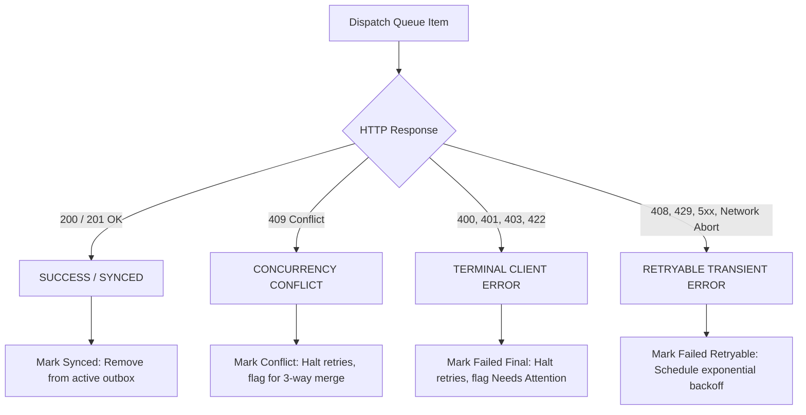

# Autosync Error Classification & Loop Prevention Architecture

**System**: India HIV/AIDS Alliance Childcare Support PWA  
**Module**: `src/lib/sync/syncOrchestrator.ts` & `src/lib/db/syncQueueRepository.ts`  
**Status**: Production Verified  

---

## 1. Error Classification Taxonomy

The PWA offline sync engine categorizes all synchronization outcomes into four discrete, mutually exclusive classes:



| HTTP Status / Cause | Error Classification | Queue Action | Backoff / Retries | UI Status |
| :--- | :--- | :--- | :--- | :--- |
| `200 OK`, `201 Created` | **Success** | `markSynced()` | Retries cleared; item marked `synced` | Confirmed / Synced (Green) |
| `400 Bad Request` | **Terminal** | `markFailedFinal()` | **Halted** (`nextRetryTimestamp: null`) | Needs attention (Red) |
| `401 Unauthorized` | **Terminal** | `markFailedFinal()` | **Halted** (`nextRetryTimestamp: null`) | Authentication required |
| `403 Forbidden` | **Terminal** | `markFailedFinal()` | **Halted** (`nextRetryTimestamp: null`) | Access denied |
| `409 Conflict` | **OCC Conflict** | `markConflict()` | **Halted** (`nextRetryTimestamp: null`) | Conflict (Yellow) |
| `422 Unprocessable` | **Terminal** | `markFailedFinal()` | **Halted** (`nextRetryTimestamp: null`) | Needs attention (Red) |
| `408 Request Timeout` | **Retryable** | `markFailedRetryable()` | Exponential backoff + full jitter | Local (Waiting) |
| `429 Too Many Requests` | **Retryable** | `markFailedRetryable()` | Exponential backoff + full jitter | Local (Waiting) |
| `500, 502, 503, 504` | **Retryable** | `markFailedRetryable()` | Exponential backoff + full jitter | Local (Waiting) |
| `AbortError` / Offline | **Retryable** | `markFailedRetryable()` | Exponential backoff + full jitter | Local (Waiting) |

---

## 2. Exponential Backoff Formula (Retryable Errors Only)

When a transient network disruption, upstream rate limit, or server outage occurs, retries are governed by bounded exponential backoff with full jitter to avoid the thundering herd problem:

$$\text{delaySeconds} = \min\left(300, 2^{\text{retryCount}} \times 3\right) + \text{jitter}$$

where:
- $\text{retryCount}$ increments on each attempt.
- $\text{delaySeconds}$ is capped at 300 seconds (5 minutes).
- $\text{jitter} \in [0, 5]$ seconds of randomized offset.
- $\text{nextRetryTimestamp} = \text{currentTimeMillis} + (\text{delaySeconds} \times 1000)$.

---

## 3. Why HTTP 422 Cannot Cause an Infinite Loop

### 3.1 The Prior Defect
Prior to this fix, when an item received HTTP 422:
1. `markFailedFinal(item.id, errMsg, 422)` set `item.status = 'failed'` and `item.nextRetryTimestamp = null`.
2. In `getPendingQueue()`:
   ```typescript
   // FLAWED PRIOR LOGIC:
   return item.nextRetryTimestamp === null || item.nextRetryTimestamp <= now;
   ```
3. Because `item.nextRetryTimestamp === null` evaluated to `true`, the terminal failure was treated as immediately eligible for retry!
4. Any event trigger (30-second polling interval, window focus, visibility change, online event, or new form submission) picked up the failed record and immediately re-sent it.
5. Furthermore, failed PATCH requests attempted to fall back to `POST /api/submissions` with a non-UUIDv4 ART ID (`"DL-SOU-101122-01"`), triggering a secondary 422 loop.

### 3.2 The Mathematical Proof of Loop Elimination
The fix implements three independent, defense-in-depth safety layers:

#### Layer 1: Outbox Query Filtering (`getPendingQueue`)
Terminal failures are explicitly disqualified at query time regardless of whether `forceAllPending` is set:
```typescript
const isTerminal =
  item.status === 'failed' &&
  (item.nextRetryTimestamp === null || [400, 401, 403, 422].includes(Number(item.lastErrorCode)));

if (isTerminal) {
  return false; // Disqualified permanently from automatic retries
}

if (item.status === 'failed') {
  // Only retryable failed items with an active future timestamp that has matured are eligible
  return item.nextRetryTimestamp !== null && item.nextRetryTimestamp <= now;
}
```

#### Layer 2: Pre-Flight Request Builder Validation
Before any network packet is dispatched, `buildCreateRequest` or `buildUpdateRequest` validates the data in memory. If the payload contains contract violations (e.g. invalid client UUID, invalid expectedVersion):
- It throws `RequestBuilderError(..., isTerminal: true)`.
- The orchestrator marks the record terminal (`markFailedFinal`) without touching the network.
- The item is immediately removed from the candidate cycle.

#### Layer 3: No Cross-Method Fallback
If a `PATCH` returns HTTP 422, the orchestrator logs the validation issues and stops. It **never** attempts to fall back to `POST`.

---

## 4. Caseworker UX for Needs Attention Items

When a record is marked as `failed_final` (due to HTTP 422):
1. The badge on the Linelist displays **Needs attention** with a red indicator.
2. The user is presented with the specific field issues returned by the server (e.g., `Invalid client UUID` or `Missing expectedVersion`).
3. The caseworker can click **Edit & Resubmit** to correct the field values in the assessment form.
4. Saving the corrected form updates the draft and explicitly resets the queue item status to `queued`, allowing a fresh sync attempt.
