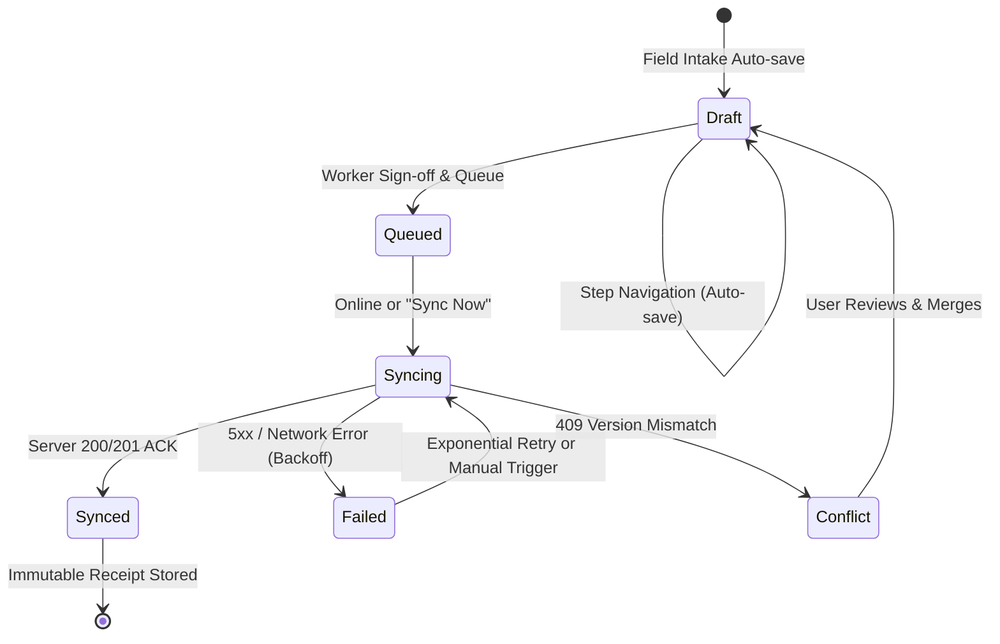

# Routing, API Contract, and Data Lifecycle Architectural Audit

**Document Version:** 1.0.0  
**Repository:** `Faribro/Childcare-Support---Phase-3-`  
**Audit Author:** Antigravity Principal Full-Stack, Test & Offline-Sync Architect  
**Audit Target Commit:** `3fe28d2` (`feature/routing-sync-hardening`)  
**Target Google Sheet:** `1tg1ROn5TbOumuCvpSlxG7OxhayYodnmoiA7qMPkbXfA` (gid=0)  
**Target Google Apps Script ID:** `1yXEgElXFb0Fb_CzTlQ8TDvRUuEYmq5dady7ialsqMnkAU1XX5SPJW8P3`  
**Date:** 2026-09-08  

---

## 1. Executive Summary & Audit Objectives

This architectural audit establishes the baseline for hardening the Childcare Support Phase 3 Progressive Web Application (PWA). The system must provide 100% offline-first field intake across India HIV/AIDS Alliance operational areas, followed by resilient, auditable, and idempotent synchronization to Google Sheets.

Prior to this audit, a live build was deployed to Render (`srv-dafr6stg1s2s73fqh9o0`). However, systematic inspection of routes, client state models, repository outboxes, API routes, and Google Apps Script bridge code reveals critical architectural gaps:
1. **Broken Links & Missing Dynamic Routes**: Essential paths such as `/supervisor` root, `/supervisor/assessments`, `/assessment/[id]`, `/assessment/[id]/edit`, `/assessment/[id]/review`, and `/assessment/[id]/receipt` either return HTTP 404 or do not exist in the Next.js App Router tree.
2. **Disconnected Draft Resume**: The draft listing screen (`/assessment/drafts`) renders a "Resume" button that hardcodes navigation to `/assessment/new`, discarding the selected draft and generating a new client UUIDv4.
3. **Outbox Model Deficiencies**: The Dexie IndexedDB `syncQueue` only supports an initial `queued` insert. It lacks an `operationType` (`CREATE` vs `UPDATE`), `idempotencyKey`, `expectedVersion`, `lastErrorCode`, and conflict metadata required for optimistic concurrency control (OCC).
4. **False Positive API Acknowledgement**: The current `/api/submissions/route.ts` catches Apps Script errors or network failures and falls back to returning HTTP 200 `status: 'success'` to the client, misleading the PWA into marking un-persisted records as synced.
5. **Apps Script Concurrency & Mutation Gaps**: `gas/Code.js` only implements an append (`POST`). It does not support `PATCH`/update, optimistic version checking (`expectedVersion`), audit logs, or record retrieval by canonical ID. Furthermore, it surfaces internal Sheet row numbers, violating the identifier governance rule that row numbers must never serve as external submission IDs.
6. **Information Architecture Gap**: Drafts and outbox items were previously segregated into disjoint screens (`/assessment/drafts` and `/assessment/sync`). Per user instruction, local drafts must be unified under the **Sync Centre** interface (`/assessment/sync`) as an integrated view of device data lifecycle states (Local Drafts, Pending Outbox, Synced Receipts).

---

## 2. Exhaustive Route & Navigation Link Inventory

### 2.1 Discovered Page Routes (Next.js App Router)
| Route Path | File Location | Observed Behavior / Status | Defect / Deficiency |
| :--- | :--- | :--- | :--- |
| `/` | `src/app/page.tsx` | HTTP 200. Static dashboard with hero, quick action cards, performance metrics, footer. | Quick action links point to fragmented supervisor routes (`/supervisor/linelist`). |
| `/assessment/new` | `src/app/assessment/new/page.tsx` | HTTP 200 locally, but reported 404 on Render when accessed directly without client hydration. | Does not support editing or resuming an existing draft. Submitting redirects to `/assessment/sync?submitted=true` without displaying a proof-of-submission receipt. |
| `/assessment/drafts` | `src/app/assessment/drafts/page.tsx` | HTTP 200. Queries Dexie `drafts` table. | "Resume" button links to `/assessment/new` rather than a dynamic draft resume route. Segregated from Sync Centre. |
| `/assessment/sync` | `src/app/assessment/sync/page.tsx` | HTTP 200. Displays queued items. Has "Sync All" button. | Does not display local drafts. Does not support conflict resolution (HTTP 409). Directly calls `POST /api/submissions` in a loop without client mutex or exponential backoff. |
| `/supervisor` | *MISSING* | HTTP 404 Not Found. | The root `/supervisor` route directory does not contain `page.tsx`. |
| `/supervisor/linelist` | `src/app/supervisor/linelist/page.tsx` | HTTP 200. Mock table of 5 beneficiaries with search, filters, CSV export. | Non-canonical route naming (should be `/supervisor/assessments`). Does not link to individual assessment detail screens. |
| `/supervisor/analytics` | `src/app/supervisor/analytics/page.tsx` | HTTP 200. High-level metric tiles. | Links back to `/supervisor/linelist` and `/assessment/new`. |
| `/supervisor/assessments` | *MISSING* | HTTP 404 Not Found. | Canonical route specified in contract does not exist. |
| `/supervisor/assessments/[id]` | *MISSING* | HTTP 404 Not Found. | Canonical route for supervisor assessment inspection does not exist. |
| `/assessment/[id]` | *MISSING* | HTTP 404 Not Found. | Canonical route for viewing synced record or resuming local draft does not exist. |
| `/assessment/[id]/edit` | *MISSING* | HTTP 404 Not Found. | Canonical route for authorized editing of synced record does not exist. |
| `/assessment/[id]/review` | *MISSING* | HTTP 404 Not Found. | Canonical route for pre-submission or pre-update review does not exist. |
| `/assessment/[id]/receipt` | *MISSING* | HTTP 404 Not Found. | Canonical route for immutable proof-of-submission receipt does not exist. |

### 2.2 Discovered API Route Handlers
| Route Path | File Location | HTTP Methods | Status / Contract Issues |
| :--- | :--- | :--- | :--- |
| `/api/health` | `src/app/api/health/route.ts` | `GET` | HTTP 200 OK. Returns service name, version `3.0.0`, timestamp, uptime. Compliant. |
| `/api/submissions` | `src/app/api/submissions/route.ts` | `POST` only | Lacks `GET` (list with cursor pagination, limit, status filter, updatedAfter). Lacks Zod payload validation. Lacks `Idempotency-Key` header handling. Silently masks Apps Script forwarding errors by returning 200 OK. |
| `/api/submissions/[submissionId]` | *MISSING* | *None* | Required `GET` (fetch single record by canonical ID) and `PATCH` (allowlisted field updates with OCC) do not exist. |
| `/api/submissions/[submissionId]/history` | *MISSING* | *None* | Required `GET` for privacy-safe audit timeline does not exist. |
| `/api/sync` | *MISSING* | *None* | Required `POST` bounded batch outbox processor does not exist. |
| `/api/reference-data` | *MISSING* | *None* | Required `GET` reference roster and clinic sites does not exist. |

### 2.3 Navigation Links & Router Calls Inventory
1. **`src/components/layout/CompactMasthead.tsx`**:
   - `href="/"` (Dashboard)
   - `href="/assessment/new"` (New Assessment)
   - `href="/assessment/drafts"` (Drafts - must be unified into Sync Centre)
   - `href="/assessment/sync"` (Sync Centre)
   - `href="/supervisor/linelist"` (Must point to canonical `/supervisor/assessments`)
   - `href="/supervisor/analytics"` (Supervisor Analytics)
2. **`src/app/page.tsx`**:
   - Hero CTA 1: `href="/assessment/new"`
   - Hero CTA 2: `href="/supervisor/linelist"` (Must point to canonical `/supervisor/assessments`)
   - Action Card 1: `href="/assessment/new"`
   - Action Card 2: `href="/assessment/drafts"` (Must point to `/assessment/sync?tab=drafts`)
   - Action Card 3: `href="/assessment/sync"`
   - Action Card 4: `href="/supervisor/analytics"`
3. **`src/app/assessment/drafts/page.tsx`**:
   - Header CTA: `href="/assessment/new"`
   - Empty State CTA: `href="/assessment/new"`
   - Card Resume Button (line 131): `href="/assessment/new"` (**CRITICAL DEFECT**: Must link to `/assessment/[localDraftId]`)
4. **`src/app/assessment/sync/page.tsx`**:
   - Header CTA: `href="/assessment/new"`
   - Empty State CTA: `href="/assessment/new"`
5. **`src/app/assessment/new/page.tsx`**:
   - Form submission (line 299): `router.push('/assessment/sync?submitted=true')` (**DEFECT**: Should direct to `/assessment/[id]/receipt` after submission, or sync center with receipt link).
6. **`src/app/supervisor/linelist/page.tsx`**:
   - Action CTA: `href="/assessment/new"`
   - Table rows have no links to view or edit assessments.
7. **`src/app/supervisor/analytics/page.tsx`**:
   - Navigation links: `href="/supervisor/linelist"`, `href="/assessment/new"`.

---

## 3. Discovered Defects, Broken Links, and Mismatches

| Finding ID | Severity | Category | Description & Impact |
| :--- | :--- | :--- | :--- |
| **DEF-001** | **CRITICAL** | Routing / UX | `/supervisor` root path returns HTTP 404 because no `page.tsx` exists at `src/app/supervisor/page.tsx`. |
| **DEF-002** | **CRITICAL** | Data Lifecycle | Resuming a draft from `/assessment/drafts` links to `/assessment/new`. The draft's saved data is never loaded, causing severe field data loss. |
| **DEF-003** | **CRITICAL** | Routing Contract | Missing dynamic routes `/assessment/[id]`, `/assessment/[id]/edit`, `/assessment/[id]/review`, and `/assessment/[id]/receipt`. Field workers cannot view a submitted record, verify a receipt, or edit approved fields. |
| **DEF-004** | **CRITICAL** | Data Integrity | `/api/submissions/route.ts` falls back to returning HTTP 200 "acknowledged" when Google Apps Script is unreachable. The client treats the record as synced when it was never written to the Sheet. |
| **DEF-005** | **HIGH** | API Contract | Missing `/api/submissions/[submissionId]` with `GET` and `PATCH`. No optimistic concurrency control (`expectedVersion` / `If-Match`), allowing concurrent overwrites. |
| **DEF-006** | **HIGH** | Information Architecture | User explicit instruction: "Also the drafts should be under the sync centre". Drafts are currently isolated on a separate route rather than unified within the Sync Centre dashboard. |
| **DEF-007** | **HIGH** | Apps Script Adapter | `gas/Code.js` only implements append. No `update`, `read`, `list`, or `history` actions. Returns internal row numbers instead of canonical UUIDs. |
| **DEF-008** | **MEDIUM** | Offline Outbox | Dexie `syncQueue` does not store `operationType: 'CREATE' | 'UPDATE'`, `expectedVersion`, or `idempotencyKey`. Overlapping sync runs are not prevented by a client mutex. |
| **DEF-009** | **MEDIUM** | Supervisor Namespace | Routes use `/supervisor/linelist` instead of the canonical `/supervisor/assessments`. |
| **DEF-010** | **LOW** | Layout Responsiveness | Mobile context bar only displays if `artNumber` or `childName` is present; drafts without an initial name appear unheaded during step 1. |

---

## 4. Architectural Unification: Drafts Under Sync Centre

### 4.1 UX & Information Architecture Unification
Per user mandate ("Also the drafts should be under the sync centre"), the **Sync Centre** (`/assessment/sync`) is upgraded to the central **Field Data Operations Hub**. It consolidates three lifecycle streams:
1. **Outbox Queue Tab**: Real-time inspection of outgoing operations (`CREATE` / `UPDATE`), retry countdowns, error states, and manual "Sync Now" trigger.
2. **Local Drafts Tab**: Complete inventory of unsubmitted assessments stored locally in Dexie IndexedDB. Each card displays completion percentage, step progress, last auto-saved timestamp, "Resume Intake" button (navigating to `/assessment/[localDraftId]`), and "Delete Draft" with modal confirmation.
3. **Synced History Tab**: Immutable log of successfully acknowledged remote submissions with canonical remote IDs, confirmation timestamps, and receipt links.

### 4.2 Route Compatibility & Backwards Compatibility
To preserve backwards compatibility with existing bookmarks and PWA shortcuts:
- `/assessment/drafts` remains a valid route that renders the Unified Sync Centre with the `tab=drafts` active by default, or seamlessly redirects via `redirect('/assessment/sync?tab=drafts')`.
- Global Masthead reflects active outbox counts and direct access to `/assessment/sync`.

---

## 5. API Behaviour & Data Contract Specifications

### 5.1 Canonical Endpoints & Request/Response Contracts

#### 1. `GET /api/health`
- **Purpose**: Liveness and readiness probe for Render and monitoring.
- **Response**:
  ```json
  {
    "status": "ok",
    "service": "childcare-support-phase-3",
    "version": "3.0.0",
    "timestamp": "2026-09-08T07:30:00.000Z",
    "uptimeSeconds": 1240
  }
  ```

#### 2. `GET /api/submissions?cursor=&limit=&status=&updatedAfter=`
- **Purpose**: Paginated listing of canonical submissions for supervisor and field reconciliation.
- **Parameters**: `cursor` (string, opaque or ISO timestamp), `limit` (number, default 20, max 100), `status` (`SYNCED` | `QUEUED`), `updatedAfter` (ISO timestamp).
- **Response**:
  ```json
  {
    "status": "success",
    "data": [
      {
        "remoteSubmissionId": "a1b2c3d4-e5f6-7890-abcd-ef1234567890",
        "clientSubmissionId": "c9d8e7f6-a5b4-3210-fedc-ba9876543210",
        "artNumber": "MH-PUN-1049",
        "childName": "Rahul S.",
        "gender": "Male",
        "calculatedAgeYears": 6,
        "district": "Pune",
        "nutritionStatus": "SAM (Severe Acute Malnutrition)",
        "recommendedGrantAmount": 4500,
        "version": 1,
        "updatedAt": "2026-09-08T07:20:00.000Z",
        "syncStatus": "synced"
      }
    ],
    "pagination": {
      "nextCursor": "2026-09-08T07:20:00.000Z",
      "hasMore": false,
      "totalCount": 1
    }
  }
  ```

#### 3. `POST /api/submissions`
- **Purpose**: Idempotent creation of a new assessment.
- **Headers**: `Idempotency-Key: <UUIDv4>` (required).
- **Body**: Validated via `completeSubmissionSchema`.
- **Response (HTTP 201 Created / HTTP 200 Existing)**:
  ```json
  {
    "status": "success",
    "acknowledged": true,
    "remoteSubmissionId": "a1b2c3d4-e5f6-7890-abcd-ef1234567890",
    "clientSubmissionId": "c9d8e7f6-a5b4-3210-fedc-ba9876543210",
    "version": 1,
    "updatedAt": "2026-09-08T07:25:00.000Z",
    "requestId": "req-89a1-43ef",
    "syncStatus": "synced",
    "isDuplicate": false
  }
  ```

#### 4. `GET /api/submissions/[submissionId]`
- **Purpose**: Retrieve canonical record by remoteSubmissionId or clientSubmissionId.
- **Response (HTTP 200)**: Full canonical assessment payload with current version, calculated nutrition triage, grant entitlement, and timestamps.
- **Error (HTTP 404)**: Standardized `{ "status": "error", "code": "NOT_FOUND", "message": "Submission not found" }`.

#### 5. `PATCH /api/submissions/[submissionId]`
- **Purpose**: Authorised modification of approved editable fields with Optimistic Concurrency Control.
- **Headers**: `If-Match: "<version>"` or body `expectedVersion: number`.
- **Allowlisted Editable Fields**:
  - Caregiver contact: `caregiverPhone`, `caregiverName`, `caregiverRelationship`
  - Socioeconomic: `monthlyHouseholdIncome`, `primaryCaregiverOccupation`, `rationCardType`
  - Clinical: `heightCm`, `weightKg`, `muacMm`, `bilateralPittingOedema`, `clinicalNotes`
  - Education: `schoolEnrolled`, `schoolType`, `schoolGrade`, `attendancePercentage`, `supportMaterialsNeeded`
  - Bank Details: `accountHolderName`, `accountNumber`, `ifscCode`, `bankName`, `branchName`, `passbookPhotoCaptured`
- **Protected / Computed Fields (Immutable via client PATCH)**:
  - `remoteSubmissionId`, `clientSubmissionId`, `artNumber`, `dob`, `calculatedAgeYears`, `bmiZScore`, `nutritionStatus`, `recommendedGrantAmount`, `createdAt`.
  - Recalculated server-side on clinical/socioeconomic updates.
- **Conflict Handling (HTTP 409 Conflict)**:
  ```json
  {
    "status": "error",
    "code": "CONCURRENCY_CONFLICT",
    "message": "The record has been updated by another caseworker.",
    "currentVersion": 2,
    "expectedVersion": 1,
    "conflictFields": ["caregiverPhone", "weightKg"],
    "resolutionPath": "REFRESH_AND_MERGE"
  }
  ```

#### 6. `GET /api/submissions/[submissionId]/history`
- **Purpose**: Privacy-safe audit log of modifications.
- **Response (HTTP 200)**:
  ```json
  {
    "status": "success",
    "remoteSubmissionId": "a1b2c3d4-e5f6-7890-abcd-ef1234567890",
    "history": [
      {
        "version": 2,
        "timestamp": "2026-09-08T07:45:00.000Z",
        "actor": "caseworker-pune-04",
        "operation": "UPDATE",
        "changedFields": ["weightKg", "clinicalNotes"],
        "requestId": "req-9b21-88fc"
      },
      {
        "version": 1,
        "timestamp": "2026-09-08T07:25:00.000Z",
        "actor": "caseworker-pune-04",
        "operation": "CREATE",
        "changedFields": ["*"],
        "requestId": "req-89a1-43ef"
      }
    ]
  }
  ```

#### 7. `POST /api/sync`
- **Purpose**: Bounded batch processor (1-10 items per batch) for offline outbox drainage with per-item status outcomes.

#### 8. `GET /api/reference-data?version=`
- **Purpose**: Dropdown reference rosters (districts, school types, ration card types) with ETag caching.

---

## 6. Local Drafts & Outbox Data Lifecycle vs Remote Operations

### 6.1 Dexie IndexedDB Schema Evolution (Version 2)
The database schema (`AllianceChildcareDB`) must be migrated from version 1 to version 2 to support the full creation/edit/versioning lifecycle:

```typescript
// Proposed Dexie v2 Stores
this.version(2).stores({
  drafts: '++id, uuid, clientSubmissionId, remoteSubmissionId, stepIndex, updatedAt, syncStatus, [demographics.artNumber]',
  syncQueue: '++id, submissionUuid, idempotencyKey, operationType, status, expectedVersion, retryCount, nextRetryTimestamp, [status+nextRetryTimestamp]',
  referenceBeneficiaries: 'artNumber, childName, district',
  auditLogs: '++id, timestamp, eventType, targetUuid',
});
```

### 6.2 State Machine Matrix: Client vs Outbox vs Server


### 6.3 Concurrency Control & Client-Side Mutex
To prevent race conditions during network reconnects or rapid "Sync All" button presses:
1. **Client Mutex**: An in-memory/broadcast lock flag (`syncInProgressLock`) ensures only one outbox worker loop executes at any instant.
2. **Backoff Formula**: For retriable failures (5xx, timeouts, network dropouts):
   $$\text{delay} = \min\left(300, 2^{\text{retryCount}} \times 3\right) + \text{jitter}(0, 5) \text{ seconds}$$
3. **Non-Retriable Failures**: HTTP 400 (Bad Schema), 401/403 (Auth Failure), and 409 (Conflict) immediately halt automatic retries and transition the queue item to `failed` (terminal) or `conflict` (requiring user merge action).

---

## 7. Google Apps Script Backend Audit & Hardening

### 7.1 Identified Vulnerabilities in Existing `gas/Code.js`
1. **Append-Only Restriction**: `doPost` always performs `sheet.appendRow(newRow)`. It cannot update existing records or track revisions.
2. **Unsafe External ID**: Uses `rowNumber: appendedRow` in responses. Row numbers change when rows are sorted, inserted, or archived, violating the rule: "Do not use Sheet row number as the canonical external submission ID".
3. **Missing Canonical Schema Columns**: Does not guarantee columns for `version`, `client_submission_id`, `remote_submission_id`, `updated_at`, `operation_key`, or audit trail.
4. **No Optimistic Concurrency Check**: Does not verify incoming `expectedVersion` against sheet version.

### 7.2 Required Apps Script Dispatch Architecture
`gas/Code.js` must be refactored into an action dispatcher supporting:
- `action: "create"`: Verifies idempotency by `_uuid` / `client_submission_id`. If exists, returns current record without creating duplicates. If new, initializes `version = 1`, writes row, and returns canonical payload.
- `action: "update"`: Locates row by `remote_submission_id` or `_uuid`. Reads current `version`. If `currentVersion !== payload.expectedVersion`, returns HTTP 409 Conflict. If versions match, writes allowlisted fields, increments `version = currentVersion + 1`, updates `updated_at`, and appends an audit record to an `Audit_Log` tab.
- `action: "read"`: Locates row by canonical ID and returns normalized JSON.
- `action: "list"`: Returns slice of rows for supervisor linelist synchronization.
- `action: "history"`: Returns audit log entries for a given submission ID.
- **Lock Protection**: All writes remain enveloped by `LockService.getScriptLock().waitLock(30000)`.

---

## 8. Canonical Route Matrix: Current vs Proposed State

| Route URI | Purpose | Current State | Proposed Implementation Plan |
| :--- | :--- | :--- | :--- |
| `/` | Field Worker & Supervisor Dashboard | Implemented (`src/app/page.tsx`) | Update navigation links to point to canonical routes (`/supervisor/assessments`, `/assessment/sync?tab=drafts`). |
| `/assessment/new` | Multi-step New Assessment Intake | Implemented (`src/app/assessment/new/page.tsx`) | Ensure route produces valid build. Link review step to `/assessment/[id]/review` or unified wizard review. |
| `/assessment/drafts` | Saved Drafts List | Implemented (`src/app/assessment/drafts/page.tsx`) | Redirect or render unified Sync Centre view with active `tab=drafts`. |
| `/assessment/sync` | Sync & Upload Centre | Implemented (`src/app/assessment/sync/page.tsx`) | Upgrade to Unified Hub with tabs: **Outbox**, **Drafts**, and **History**. Integrate client lock and backoff. |
| `/assessment/[id]` | Canonical Record View / Draft Resume | **Missing (404)** | Create `src/app/assessment/[id]/page.tsx` with ID guard: if local draft, allow resume; if synced record, render read-only canonical assessment with "Edit" action. |
| `/assessment/[id]/edit` | Authorized Editing of Synced Record | **Missing (404)** | Create `src/app/assessment/[id]/edit/page.tsx` restricting inputs to allowlisted fields and binding `expectedVersion`. |
| `/assessment/[id]/review` | Pre-submission / Pre-update Review | **Missing (404)** | Create `src/app/assessment/[id]/review/page.tsx` rendering clinical triage summary and consent check. |
| `/assessment/[id]/receipt` | Immutable Proof of Submission | **Missing (404)** | Create `src/app/assessment/[id]/receipt/page.tsx` rendering confirmation QR/UUID, timestamp, grant entitlement. |
| `/supervisor` | Supervisor Hub Dashboard | **Missing (404)** | Create `src/app/supervisor/page.tsx` providing supervisor overview, triage statistics, and navigation. |
| `/supervisor/assessments` | Supervisor Master Line-List | **Missing (404)** (`/supervisor/linelist` exists) | Implement `src/app/supervisor/assessments/page.tsx` (or alias `/supervisor/linelist`) linking to `/supervisor/assessments/[id]`. |
| `/supervisor/assessments/[id]` | Supervisor Detailed Clinical Audit | **Missing (404)** | Create `src/app/supervisor/assessments/[id]/page.tsx` providing clinical review and audit history. |
| `/supervisor/analytics` | Malnutrition & Grant Analytics | Implemented (`src/app/supervisor/analytics/page.tsx`) | Retain and ensure all outbound links reference canonical paths. |

---

## 9. Risk-Ranked Remediation Plan

```
┌────────────────────────────────────────────────────────────────────────┐
│                        RISK-RANKED PHASING                             │
├────────────────────────────────────────────────────────────────────────┤
│ PHASE 1 (P0): Core Routing & ID Disambiguation                         │
│ • Implement canonical routes: /supervisor, /assessment/[id], etc.       │
│ • Build Route/ID parser guard (disambiguate local draft vs remote UUID)│
│ • Unify Drafts under Sync Centre (/assessment/sync?tab=drafts)         │
├────────────────────────────────────────────────────────────────────────┤
│ PHASE 2 (P0): Outbox & API Hardening                                   │
│ • Upgrade Dexie to v2 schema with operationType and OCC fields         │
│ • Implement Next.js API endpoints: GET/POST/PATCH /api/submissions    │
│ • Add Idempotency-Key validation and Zod schema enforcement            │
│ • Prevent false-positive ACK on external network failure               │
├────────────────────────────────────────────────────────────────────────┤
│ PHASE 3 (P1): Concurrency Control & Apps Script Adapter Hardening      │
│ • Upgrade gas/Code.js with create, update, read, history actions       │
│ • Implement 409 Conflict handling and OCC version increments           │
│ • Enforce field allowlist for PATCH mutations                          │
├────────────────────────────────────────────────────────────────────────┤
│ PHASE 4 (P1): Automated Quality & Test Suite Gating                    │
│ • Vitest unit tests: domain mapping, Zod, idempotency, OCC, backoff   │
│ • API route integration tests with mocked Apps Script bridge           │
│ • Playwright E2E browser tests: intake -> sync -> edit -> OCC conflict│
│ • Staging setup checklist with synthetic data exclusively             │
└────────────────────────────────────────────────────────────────────────┘
```

---

## 10. Data-Contract & Staging Environment Blockers

1. **Google Apps Script Live Deployment URL (`APPS_SCRIPT_URL`)**:
   - In production/staging, `APPS_SCRIPT_URL` must point to the web app deployment of project `1yXEgElXFb0Fb_CzTlQ8TDvRUuEYmq5dady7ialsqMnkAU1XX5SPJW8P3`.
   - The Next.js API route will be configurable via environment variable `APPS_SCRIPT_URL`. For local development and automated CI tests, a fully functional mock adapter must run when `APPS_SCRIPT_URL` is unset or points to test fixture servers, guaranteeing zero disruption and zero external network dependencies during quality gates.
2. **Sheet Header Migration Requirements**:
   - To support OCC and audit tracking without manual row searching, the target Google Sheet (`1tg1ROn5TbOumuCvpSlxG7OxhayYodnmoiA7qMPkbXfA`) must include the following header columns on Row 3:
     `_uuid`, `remote_submission_id`, `version`, `idempotency_key`, `timestamp`, `updated_at`, `interviewer_name`, `art_number`, `child_name`, `dob`, `calculated_age`, `gender`, `caregiver_name`, `caregiver_relationship`, `caregiver_phone`, `orphan_status`, `monthly_household_income`, `ration_card_type`, `height_cm`, `weight_kg`, `muac_mm`, `bilateral_pitting_oedema`, `bmi_z_score`, `nutrition_status`, `school_enrolled`, `school_grade`, `attendance_percentage`, `grant_recommended`, `bank_account_number`, `ifsc_code`, `sync_state`.
   - If any column is missing in the live sheet, `gas/Code.js` dynamic header matching (`colMap`) safely leaves the column empty, ensuring forward and backward compatibility.
3. **Zero Stigmatising Labels & Plaintext PII**:
   - Aadhaar numbers must remain masked (`XXXX-XXXX-1234`).
   - Diagnostic labels (e.g. HIV status) must never be transmitted or stored in sheet headers or logs; only non-stigmatising clinical parameters (`art_number`, nutritional triage) are permissible.
