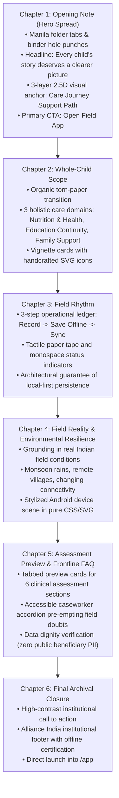

# Reference Website Storyboard & Scroll Scene Forensics
**Project**: India HIV/AIDS Alliance — Child Nutrition & Support PWA (Phase 3)  
**Role**: Principal Product Designer, Creative Director & Staff Front-End Engineer  
**Branch**: `research/landing-reference-forensics-v2`  
**Base Commit**: `79f832e255ed630562c959776bae55e28ca3a4a9` (`main`)  
**Methodology**: Automated Playwright continuous scroll sampling at 250–400px intervals from viewport 0px to document footer.

---

## 1. Comparative Reference Storyboard Analysis

---

### Storyboard 1: Mary Colter — The Mosby Files (`/cases/mary-colter`)
*Document Height: ~3,200px | Sampling Interval: 350px*

| Scene # | Scroll Position | Dominant Viewport Elements & Visual Composition | Transition Trigger & Mechanics | User-Control & Timing | Transferable Principle | Alliance Landing Translation Principle |
| :---: | :---: | :--- | :--- | :--- | :--- | :--- |
| **01** | `0 – 350px` | Minimal header (`MOSBY'S FILES`, `About`), oversized headline (`MARY COLTER`), carmine red folder tab ear (`Mary Colter`, `Louis Sullivan`), paper sheet with hole punches, silver paperclip, archival portrait, typewriter metadata ledger. | Initial page load; gentle settling of paper layers, fade-in of metadata. | Immediate user wheel/touch control. Zero scroll hijacking. | **Archival Dossier Framing**: The screen is an open investigator's folder rather than a digital webpage. | **The Field Notebook Spread**: Introduce the caseworker journal with folder tab ears, binder hole punches, and rubber stamp seal. |
| **02** | `350 – 700px` | Headline smoothly scrolls out; sticky sub-header locks `MARY COLTER` into a compact 40px top bar. Editorial body column enters with large drop-cap "W". Right index tabs stay sticky on the folder edge. | Scroll-progress-linked translation of title; sticky locking of top bar. | Completely native scroll container; continuous fluid reading. | **Progressive Header Condensation**: The title condenses into a quiet status bar without covering content. | **Quiet Sticky Chapter Bar**: The title condenses to a slim chapter status indicator with active section indicator. |
| **03** | `700 – 1050px` | Vintage postcard artifact (`"POST CARD"`) enters from bottom-left with a slight paper tilt; architectural photograph of Hopi House enters with black frame border. Masking tape strip anchors bottom of note. | Scroll entry; staggered translateY (-15px to 0px) and subtle opacity transition. | Gentle easing; does not trap or stutter scrolling. | **Layered Archival Evidence**: Primary source materials (cards, photos) overlap like items on a desk. | **Sanitized Casework Evidence**: Pinned field notes and child-support cards enter with tactile paper tape. |
| **04** | `1050 – 1400px` | Long-form editorial text discussing indigenous craft and stonework; second architectural plate enters on right with monospaced caption label. | Native scroll flow; text wraps cleanly around floating image plates. | Standard reading rhythm; excellent typographic line length (65ch). | **Typographic Gravitas**: High-legibility serif text paired with clinical monospace metadata. | **Dignified Care Narrative**: Clear, respectful explanation of nutrition and education assessment domains. |
| **05** | `1400 – 1750px` | Archival architectural blueprint sheet with grid background; sepia drawing clipped to paper with a second paperclip. Monospace date stamps. | Scroll entry; blueprint sheet slides into view as an inserted archival leaf. | Restrained, non-blocking motion. | **Insert Sheets / Foldouts**: Changing sheet backgrounds to represent different investigative artifacts. | **Assessment Form Leaf**: An inserted field intake sheet previewing the 6 assessment domains. |
| **06** | `1750 – 2100px` | Quotes from Mary Colter in large italic serif; full-width desert stone texture plate showing the Watchtower at Desert View. | Scroll progress; subtle parallax on photographic plate. | Gentle velocity; no jarring shifts. | **Atmospheric Grounding**: Real physical landscape images connect the archival work to the physical earth. | **Field Reality Grounding**: Illustrating real rural Indian field conditions (rain, offline remote homes). |
| **07** | `2100 – 2600px` | Chronology ledger: two-column timeline of completed works with years stamped in bold monospace (`1905`, `1914`, `1932`). | Scroll entry; timeline dots connect via a vertical rule. | Native vertical scanning. | **Structured Ledger History**: Clear chronological progression with minimal ornamentation. | **3-Step Field Rhythm**: Chronological workflow: 1. Record $\to$ 2. Save Offline $\to$ 3. Sync. |
| **08** | `2600 – End` | Blue folder tab for next case study (`Louis Sullivan`) expands; yellow pill CTA button (`Next Case ->`); minimal archival copyright footer. | Scroll entry into footer dock; next case card lifts slightly on hover. | Direct link navigation to next case study. | **Contextual Next Chapter**: Invitation to proceed to the next dossier without leaving the archival world. | **Direct Field App Handoff**: High-contrast, dignified final invitation to "Open the Field App". |

---

### Storyboard 2: Mal Prince — Illustrated Editorial Portfolio (`/en`)
*Document Height: ~6,800px | Sampling Interval: 380px*

| Scene # | Scroll Position | Dominant Viewport Elements & Visual Composition | Transition Trigger & Mechanics | User-Control & Timing | Transferable Principle | Alliance Landing Translation Principle |
| :---: | :---: | :--- | :--- | :--- | :--- | :--- |
| **01** | `0 – 380px` | Deep midnight blue sky (`#0D2033`), golden constellation stars, illustrated character on globe with telescope, poetic introductory text. | Load entrance; subtle twinkle of stars and slow float of celestial bodies. | Zero interaction delay; text readable immediately. | **Poetic Narrative Centerpiece**: An illustrated hero object that establishes an emotional bond instantly. | **Support Journey Anchor**: A warm, illustrated path connecting child nutrition, schooling, and shelter. |
| **02** | `380 – 760px` | Night sky transitions into a warm ochre horizon; rolling watercolor hills divide the dark canvas from the warm earth. | Continuous scroll; background color lerps smoothly via CSS/canvas gradient. | Native scroll; no pinning or hijacked momentum. | **Organic Horizon Dividers**: Replacing sharp 1px lines with soft, watercolor or torn paper edges. | **Torn Paper Chapter Horizons**: Warm cotton paper dividers between the landing page's main sections. |
| **03** | `760 – 1140px` | Warm golden yellow field; headline `History` in classic editorial serif; three die-cut paper cloud speech bubbles containing story vignettes. | Scroll entry; clouds float into place with gentle ease-out translate. | Non-blocking; readers can pause or scroll past at will. | **Vignette Enclosures**: Text placed inside friendly, organic shapes rather than sharp rectangular boxes. | **Whole-Child Vignettes**: Friendly, rounded cards representing Nutrition, Education, and Household care. |
| **04** | `1140 – 1520px` | Hand-drawn birds flying across the yellow field; secondary illustrated character with watercolor washes; chapter caption. | Scroll progress; subtle horizontal parallax on birds. | Very gentle; respects user reading pace. | **Whimsical Atmospheric Details**: Small handcrafted touches that make the digital world feel lovingly made. | **Hand-Drawn Field Details**: Subtle pencil arrows, route markers, and caseworker margin notes. |
| **05** | `1520 – 2200px` | Multi-chapter project gallery: large photographic cards set against torn paper cutouts with elegant serif labels. | Scroll entry; cards reveal with staggered opacity. | Full keyboard and touch accessibility. | **Editorial Card Rhythm**: Varying scale between hero imagery and concise explanatory captions. | **Assessment Domain Cards**: Sanitized UI previews displaying demographic, clinical, and expense steps. |
| **06** | `2200 – End` | Final illustrated scene: character resting on hill; warm sun setting; clean contact links in simple typography. | Scroll entry into calm footer closure. | Uncluttered, peaceful conclusion. | **Calm Institutional Closure**: Ending the journey with warmth, clarity, and an invitation to engage. | **Warm Humanitarian Closure**: Alliance India institutional footer with clear offline certification. |

---

### Storyboard 3: Mr. Panda’s Psychologically Safe Portfolio
*Single-Screen Spatial Diorama | Interactive 2.5D Craft*

| Scene # | Viewport Focus | Dominant Viewport Elements & Visual Composition | Transition Trigger & Mechanics | User-Control & Timing | Transferable Principle | Alliance Landing Translation Principle |
| :---: | :---: | :--- | :--- | :--- | :--- | :--- |
| **01** | Entire Viewport | Blue-ruled notebook paper backdrop with red vertical margin rule; panda on bicycle mounted on wooden popsicle stick; airplane on string; taped post-it note ("ABOUT ME"); folded green paper grass. | Initial load; cutouts bob with subtle inertia; responds to pointer movement with 2.5D perspective shift. | Pointer tracking; click on taped notes opens project modals. | **Tactile Papercraft Diorama**: Everyday stationery objects (ruled paper, tape, sticks, cardstock) create an unforgettable handmade world. | **Notebook Materiality in CSS/SVG**: Authentic ruled paper lines, red margin guideline, taped case notes, and wooden clip pins—all rendered in 100% lightweight CSS/SVG. |

---

### Storyboard 4: Aardvark Book Club (`/`)
*Document Height: ~7,200px | Sampling Interval: 400px*

| Scene # | Scroll Position | Dominant Viewport Elements & Visual Composition | Transition Trigger & Mechanics | User-Control & Timing | Transferable Principle | Alliance Landing Translation Principle |
| :---: | :---: | :--- | :--- | :--- | :--- | :--- |
| **01** | `0 – 400px` | Warm marigold yellow backdrop (`#FFBF3F`), floating transparent pill navigation bar, hyper-bold display title (`Unbox stories worth talking about`), 3D hardcover books floating at dynamic angles with cloth spines and bookmark ribbons, high-contrast magenta CTA button. | Load entrance; books settle into angular perspective; CTA button has high visual pop. | Native scrolling; immediate CTA clickability. | **High-Impact Bookish Physicality**: Immediate dimensional object presence paired with fearless typographic scale. | **Dimensional Field Notebook Spread**: An open, tactile case file spread occupying the hero with immediate primary action. |
| **02** | `400 – 900px` | Curved cream topographical wave (`#FFFDF7`) transitions the background from yellow to ivory; headline `How it works` with 3 numbered step cards (`1. Pick your reads`, `2. We deliver`, `3. Read & share`). | Scroll entry; wave divider creates seamless transition; step cards reveal cleanly. | Scannable in 3 seconds; clear numbers. | **3-Step Workflow Demystification**: Breaking a complex system into 3 friendly, highly legible cards. | **3-Step Field Rhythm**: `1. Record what matters` $\to$ `2. Save and continue offline` $\to$ `3. Sync when connected`. |
| **03** | `900 – 1600px` | Interactive book carousel: hardcover covers with custom color spines and category pills (Fiction, Memoir, Thriller). | Horizontal drag / arrow buttons; active book lifts. | Accessible keyboard arrow navigation. | **Tabbed / Categorized Exploration**: Allowing the visitor to inspect options without navigating away. | **Assessment Tab Preview**: Tabbed preview cards for Demographics, Clinical Nutrition, and Education Grants. |
| **04** | `1600 – 2400px` | High-contrast callout banner with membership perks; vibrant photo collage of readers holding physical books; social proof quotes. | Scroll entry; photo collage has subtle layer overlap. | Human-centered proof points. | **Human-Centered Reality**: Grounding the product in real people using it. | **Field Readiness Section**: Showing caseworkers operating under real field conditions (monsoon rains, offline). |
| **05** | `2400 – 3200px` | Clean accordion FAQ section: bold questions with smooth expand/collapse chevrons and high-contrast answers. | Click / Enter key on accordion triggers; smooth height animation. | Full ARIA `aria-expanded` support; keyboard focusable. | **Objection Preemption via FAQ**: Resolving doubts about reliability, pricing, and mechanics. | **Frontline Field FAQ**: Answering caseworker questions on offline persistence, battery use, and data privacy. |
| **06** | `3200 – End` | Final high-contrast repeat CTA banner; comprehensive multi-column footer with social links and compliance text. | Native scroll closure; repeat CTA ensures conversion after education. | Direct conversion pathway. | **Repeat Primary Action**: Providing an immediate action path at the bottom of the learning journey. | **Final CTA Spread**: Prominent "Open Field App" call to action with PWA install option. |

---

## 2. Synthesis of Narrative Rhythm for Alliance India

By analyzing the scroll progressions of these four masters, the optimal narrative sequence for the Alliance India public landing page is synthesized into **6 coherent chapters**:

